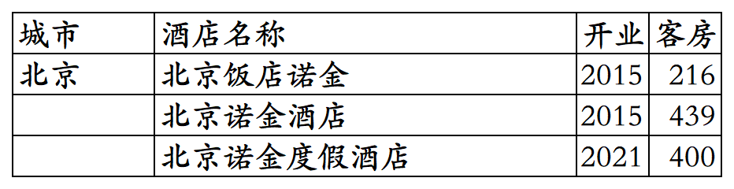
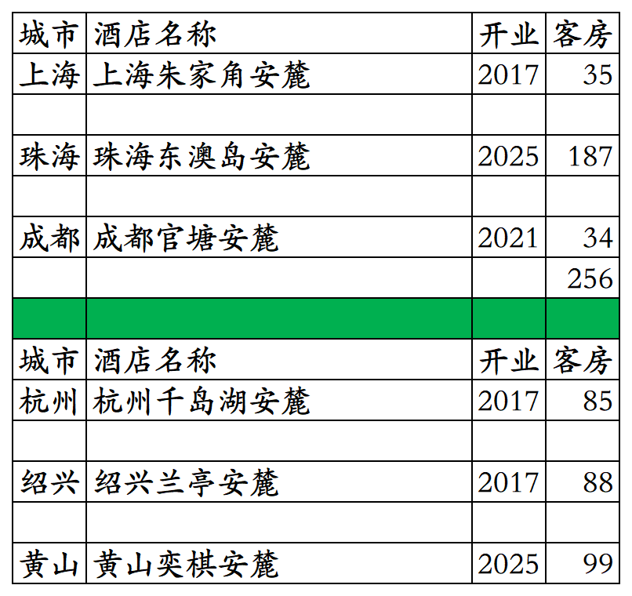

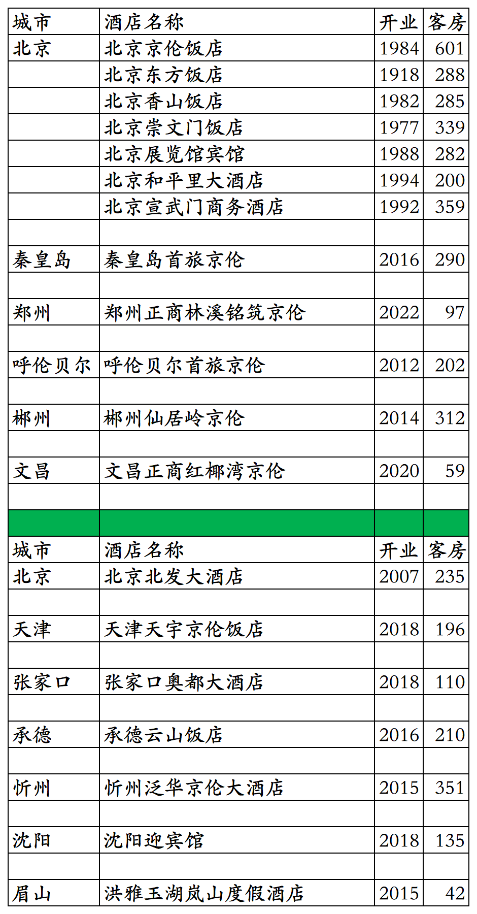
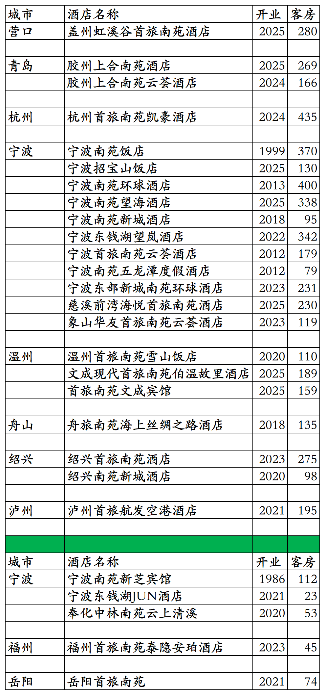
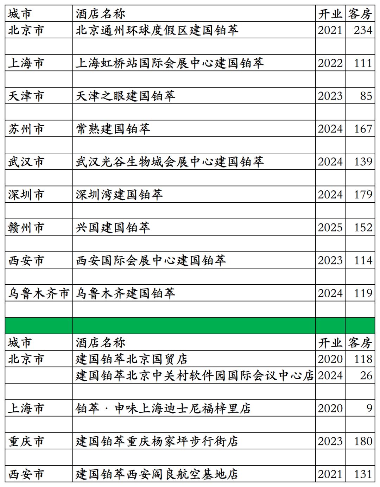
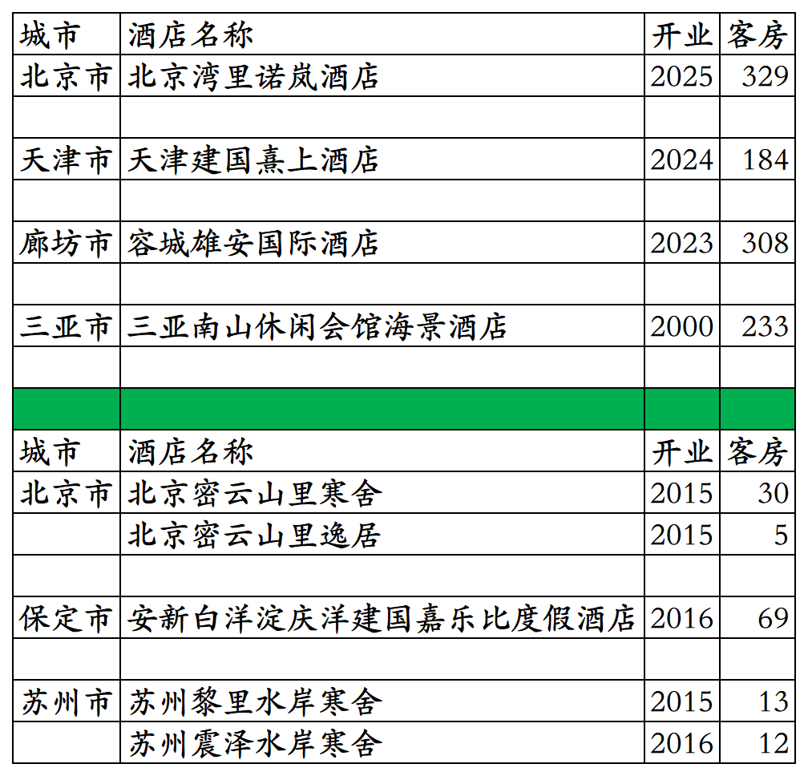

# 首旅高端品牌开业及退出酒店统计2025版

> 本文转载自微信公众号 **不同的角落**，已获作者授权。  
> 原文发布于 2026年2月27日 23:08  
> 原文链接：[mp.weixin.qq.com](https://mp.weixin.qq.com/s?__biz=MzU4OTczMzkwNw==&mid=2247611828&idx=1&sn=72e09a8226c499e4f1bb6a9092c8fcb4&scene=21#wechat_redirect)

---

首旅酒店集团旗下高端品牌(其实说全服务品牌应该更恰当，有些所谓高端品牌旗下酒店不都是高端酒店)开业及退出酒店统计，统计数据截至2025年12月31日。

不含首旅集团旗下尚未划归首旅酒店集团旗下的北京饭店、北京宝格丽酒店、北京颐和宾馆、北京贵宾楼饭店、北京长富宫饭店、北京长城饭店、北京新世纪饭店等高端酒店。

不含首旅酒店与凯宾斯基合资公司管理运营的凯宾斯基酒店集团旗下品牌酒店。不含首旅酒店旗下加盟凯悦尚选品牌的北京首北兆龙饭店。

客房数据主要来自于首旅酒店官方平台与OTA，部分酒店客房数量打过酒店电话核实，记录的是酒店员工告知的客房数量。

首旅酒店旗下高端品牌有诺金、安麓、诺岚、建国、京伦、建国熹上、南苑、南山会馆、建国铂萃，之前还有嘉乐比品牌以及与山里寒舍合作的首旅寒舍品牌。

首旅旗下高端酒店(全服务酒店)三星级到五星级档次都有。

首享会会员计划，分为新秀会员、精英会员、大使会员、传奇会员、荣誉会员五个等级。

不过首旅酒店所谓的高端酒店会员计划首享会就是个笑话，包括3家诺金、3家安麓、1家南山会馆、多家建国/京伦/南苑/建国铂萃品牌酒店并不参加首享会会员计划，首享会小程序上多家在营酒店所有日期都不可以预订，首享会小程序上多家酒店早已退出首旅翻牌为其它酒店或停业。

目前首旅高端品牌酒店在北京、上海、天津、河北、山西、河南、辽宁、吉林、内蒙古、江苏、山东、安徽、浙江、福建、湖北、湖南、广东、江西、四川、贵州、云南、海南、陕西、甘肃、宁夏、新疆有酒店。国外白俄罗斯明斯克还有1家。

开业：新酒店开业或是其它酒店翻牌加入时间；

客房：客房数量。

个人精力有限，部分酒店开业/退出/下线时间以及客房数量难免有错误，欢迎各位告知指正，谢谢！

诺金品牌酒店。

安麓品牌开业及退出酒店。

建国品牌开业及历年退出/关停酒店。大兴南航城颐悦楼就是现在的南航明珠酒店旗下北京明珠酒店大兴机场店。

京伦品牌开业及历年退出/关停酒店。

首旅南苑品牌开业及历年退出酒店。

建国铂萃品牌开业及历年退出酒店。

其它品牌开业及历年退出/关停酒店。

**其它国内酒店集团开业酒店统计**：

01、锦江国内高端酒店开业及退出统计

[锦江国内高端酒店开业及退出统计2025版](https://mp.weixin.qq.com/s?__biz=MzU4OTczMzkwNw==&mid=2247609898&idx=1&sn=1bf95d3afb9ca7c4c201c8844fb7be47&scene=21#wechat_redirect)

02、华住国内高端酒店开业及退出统计

[华住国内高端酒店开业及退出统计2025版](https://mp.weixin.qq.com/s?__biz=MzU4OTczMzkwNw==&mid=2247606873&idx=1&sn=68d0d9a13b1fd7c801ba71d81d56c9fa&scene=21#wechat_redirect)

03、东呈高端酒店

[东呈高端酒店开业及退出统计2025版](https://mp.weixin.qq.com/s?__biz=MzU4OTczMzkwNw==&mid=2247609471&idx=1&sn=3f9b86e6bb44de42272efdb69f66966f&scene=21#wechat_redirect)

04、开元开业及退出酒店统计

[开元开业及退出酒店统计2025版](https://mp.weixin.qq.com/s?__biz=MzU4OTczMzkwNw==&mid=2247607605&idx=1&sn=b497ea72bace78160605c89c0b16bfa9&scene=21#wechat_redirect)

05、万达开业及退出酒店统计

[万达开业及退出酒店统计2025版](https://mp.weixin.qq.com/s?__biz=MzU4OTczMzkwNw==&mid=2247607837&idx=1&sn=fa333c513bfaaa4c680f27e130ae2132&scene=21#wechat_redirect)

06、君亭开业及退出酒店统计

[君亭开业及退出酒店统计2025版](https://mp.weixin.qq.com/s?__biz=MzU4OTczMzkwNw==&mid=2247593231&idx=1&sn=e77507548dc06ec4350502f21ad6b17f&scene=21#wechat_redirect)

07、雷迪森开业及退出酒店统计

[雷迪森开业及退出酒店统计2025版](https://mp.weixin.qq.com/s?__biz=MzU4OTczMzkwNw==&mid=2247611063&idx=1&sn=4d963acb21a83c6fc1caa1050de3badd&scene=21#wechat_redirect)

08、凤悦开业及退出酒店统计

[凤悦开业及退出酒店统计2025版](https://mp.weixin.qq.com/s?__biz=MzU4OTczMzkwNw==&mid=2247610996&idx=1&sn=9771839fa64947b727044b9dd070ac86&scene=21#wechat_redirect)

09、中旅国内开业及退出酒店统计

[中旅国内开业及退出酒店统计2025版](https://mp.weixin.qq.com/s?__biz=MzU4OTczMzkwNw==&mid=2247577094&idx=1&sn=fd7d1711998de8f9bcbb32dd52ef7f3f&scene=21#wechat_redirect)

10、金陵开业及退出酒店统计

[金陵开业及退出酒店统计2025版](https://mp.weixin.qq.com/s?__biz=MzU4OTczMzkwNw==&mid=2247576523&idx=1&sn=243a19d77fcfb36bf194c97cc182834b&scene=21#wechat_redirect)

11、格兰云天开业及退出酒店统计

[格兰云天开业及退出酒店统计2025版](https://mp.weixin.qq.com/s?__biz=MzU4OTczMzkwNw==&mid=2247579183&idx=1&sn=5a1fea0a80f62d8e92af07c25e0c1c1d&scene=21#wechat_redirect)

12、中维开业及退出酒店统计

[中维开业及退出酒店统计2025版](https://mp.weixin.qq.com/s?__biz=MzU4OTczMzkwNw==&mid=2247581530&idx=1&sn=72add848f0fb5f82831f2d46855ee507&scene=21#wechat_redirect)

13、华天开业及退出酒店统计

[华天开业及退出酒店统计2025版](https://mp.weixin.qq.com/s?__biz=MzU4OTczMzkwNw==&mid=2247583997&idx=1&sn=46d5ab82f71c6249eb3f811ec108a794&scene=21#wechat_redirect)

14、凯莱开业及退出酒店统计

[凯莱开业及退出酒店统计2025版](https://mp.weixin.qq.com/s?__biz=MzU4OTczMzkwNw==&mid=2247611049&idx=1&sn=bf910cbfed36554af7ec82ad3196cf20&scene=21#wechat_redirect)

15、绿地开业及退出酒店统计

[绿地开业及退出酒店统计2025版](https://mp.weixin.qq.com/s?__biz=MzU4OTczMzkwNw==&mid=2247611758&idx=1&sn=04c4aacebb06c3a01883f452c18aad52&scene=21#wechat_redirect)

16、厦门建发开业及退出酒店统计

[厦门建发开业及退出酒店统计2025版](https://mp.weixin.qq.com/s?__biz=MzU4OTczMzkwNw==&mid=2247610581&idx=1&sn=397cee1f3684486c32ebeb215249ffce&scene=21#wechat_redirect)

17、厦门佰翔开业及退出酒店统计

[厦门佰翔开业及退出酒店统计2025版](https://mp.weixin.qq.com/s?__biz=MzU4OTczMzkwNw==&mid=2247579739&idx=1&sn=89912fcad6eab52a875ba40260bdef98&scene=21#wechat_redirect)

18、福建旅发开业及退出酒店统计

[福建旅发开业及退出酒店统计2025版](https://mp.weixin.qq.com/s?__biz=MzU4OTczMzkwNw==&mid=2247576672&idx=1&sn=bcbdf134ca973ca406d8e5d572069de3&scene=21#wechat_redirect)

19、远洲旅业开业及退出酒店统计

[远洲旅业开业及退出酒店统计2025版](https://mp.weixin.qq.com/s?__biz=MzU4OTczMzkwNw==&mid=2247576868&idx=1&sn=a5fc7218eb9630362828b884a61f4d6d&scene=21#wechat_redirect)

20、乔治莫兰迪开业酒店统计

[乔治莫兰迪开业酒店统计2025版](https://mp.weixin.qq.com/s?__biz=MzU4OTczMzkwNw==&mid=2247590594&idx=1&sn=ccb2ef8da02e866e2706c5dffced1fbd&scene=21#wechat_redirect)

更多的国内酒店统计、年度酒店排行、酒店常识、酒店行业资讯、酒店集团、航空常识、沈阳旅游、沙发客、打油诗等相关内容可以到我的微信公众号里查看。

也欢迎大家关注我的微信公众号和视频号，名称都是：**不同的角落**

微信直接搜索不同的角落就可以搜索到。

也可以直接点开下方公众号名片关注。