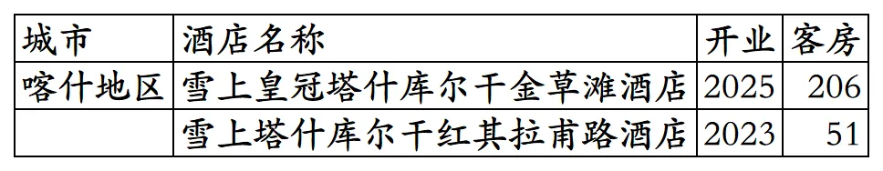
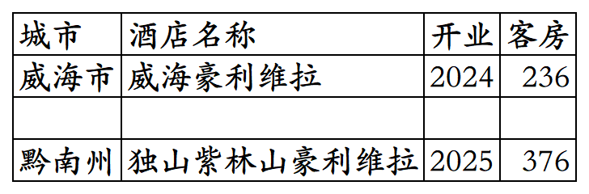
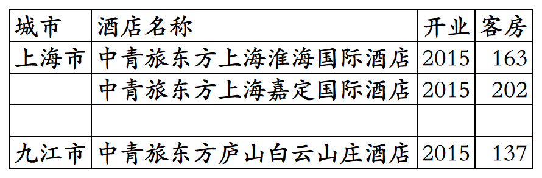
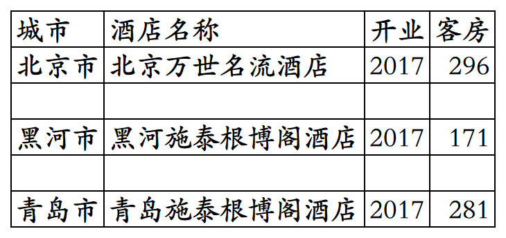

# 格林高端品牌开业及退出酒店统计2025版

> **作者**：不同的角落  
> **发布时间**：2026年2月28日 23:13  
> **原文链接**：[格林高端品牌开业及退出酒店统计2025版](https://mp.weixin.qq.com/s?__biz=MzU4OTczMzkwNw==&mid=2247611836&idx=1&sn=964da1e90a749087b6734d2c8bbdf280&scene=21#wechat_redirect)

---

格林酒店集团旗下高端品牌(除雪上系列外都是合作品牌)开业及退出酒店统计，统计数据截至2025年12月31日。

不含曾加入格林后又转投中旅旗下的雅阁酒店管理(北京)有限公司旗下酒店，格林2019年曾入股60%成为雅阁大股东，后双方闹掰；2025年央企中旅酒店入股雅阁成为大股东。

不含之前豪利维拉在国内开发运营的3家酒店，豪利维拉之前在国内开发运营的3家酒店目前仅剩株洲炎陵1家，上海与长沙2家豪利维拉酒店都已退出，上海豪利维拉曾上线过格林官方平台。

客房数据主要来自于格林酒店官方平台与OTA，部分酒店客房数量打过酒店电话核实，记录的是酒店员工告知的客房数量。

格林酒店旗下高端品牌有雪上系列(雪上、雪上皇冠)、合作的马来西亚豪利维拉酒店集团旗下豪利维拉品牌。

之前还与中青旅合作过中青旅东方酒店，与德国施泰根博阁(后来改名为德意志，被华住收购)合作过施泰根博阁酒店。

格美会会员计划，分为Meta卡、数字卡、贵宾卡、金卡、铂金卡、钻石卡六个等级。

目前格林高端品牌酒店在山东、贵州、新疆有酒店。

开业：新酒店开业或是其它酒店翻牌加入时间；

客房：客房数量。

个人精力有限，部分酒店开业/退出/下线时间以及客房数量难免有错误，欢迎各位告知指正，谢谢！

雪上系列品牌开业酒店，2家酒店都在新疆喀什地区塔什库尔干县。

豪利维拉品牌开业酒店，1家酒店在山东威海，另1家酒店在贵州黔南布依族苗族自治州独山县，原天下第一水司楼改造。

已退出的3家中青旅东方酒店。2015年3家酒店上线格林官方平台，其中上海淮海国际酒店与九江庐山白云山庄酒店原来都是温德姆旗下豪生品牌酒店，退出豪生翻牌中青旅东方品牌后，最终又重新翻牌为原豪生品牌。也就是现在的上海嘉豪淮海国际豪生酒店与庐山嘉豪淮海国际豪生酒店。

已退出的3家施泰根博阁酒店。2017年3家酒店上线格林官方平台，2019年华住收购德意志后，国内3家施泰根博阁酒店退出德意志，黑河银建施泰根博阁酒店翻牌为首旅旗下建国品牌，2021年又退出首旅，现黑河银建酒店；青岛施泰根博阁酒店原计划用名青岛城际酒店，后来用名青岛施泰根博阁城际酒店，最后又改名为青岛施泰根博阁酒店，2019年退出德意志后更名为青岛汉德博阁酒店。

**其它国内酒店集团开业酒店统计**：

01、锦江国内高端酒店开业及退出统计

[锦江国内高端酒店开业及退出统计2025版](https://mp.weixin.qq.com/s?__biz=MzU4OTczMzkwNw==&mid=2247609898&idx=1&sn=1bf95d3afb9ca7c4c201c8844fb7be47&scene=21#wechat_redirect)

02、华住国内高端酒店开业及退出统计

[华住国内高端酒店开业及退出统计2025版](https://mp.weixin.qq.com/s?__biz=MzU4OTczMzkwNw==&mid=2247606873&idx=1&sn=68d0d9a13b1fd7c801ba71d81d56c9fa&scene=21#wechat_redirect)

03、首旅高端品牌开业及退出酒店统计

[首旅高端品牌开业及退出酒店统计2025版](https://mp.weixin.qq.com/s?__biz=MzU4OTczMzkwNw==&mid=2247611828&idx=1&sn=72e09a8226c499e4f1bb6a9092c8fcb4&scene=21#wechat_redirect)

04、东呈高端酒店

[东呈高端酒店开业及退出统计2025版](https://mp.weixin.qq.com/s?__biz=MzU4OTczMzkwNw==&mid=2247609471&idx=1&sn=3f9b86e6bb44de42272efdb69f66966f&scene=21#wechat_redirect)

05、开元开业及退出酒店统计

[开元开业及退出酒店统计2025版](https://mp.weixin.qq.com/s?__biz=MzU4OTczMzkwNw==&mid=2247607605&idx=1&sn=b497ea72bace78160605c89c0b16bfa9&scene=21#wechat_redirect)

06、万达开业及退出酒店统计

[万达开业及退出酒店统计2025版](https://mp.weixin.qq.com/s?__biz=MzU4OTczMzkwNw==&mid=2247607837&idx=1&sn=fa333c513bfaaa4c680f27e130ae2132&scene=21#wechat_redirect)

07、君亭开业及退出酒店统计

[君亭开业及退出酒店统计2025版](https://mp.weixin.qq.com/s?__biz=MzU4OTczMzkwNw==&mid=2247593231&idx=1&sn=e77507548dc06ec4350502f21ad6b17f&scene=21#wechat_redirect)

08、雷迪森开业及退出酒店统计

[雷迪森开业及退出酒店统计2025版](https://mp.weixin.qq.com/s?__biz=MzU4OTczMzkwNw==&mid=2247611063&idx=1&sn=4d963acb21a83c6fc1caa1050de3badd&scene=21#wechat_redirect)

09、凤悦开业及退出酒店统计

[凤悦开业及退出酒店统计2025版](https://mp.weixin.qq.com/s?__biz=MzU4OTczMzkwNw==&mid=2247610996&idx=1&sn=9771839fa64947b727044b9dd070ac86&scene=21#wechat_redirect)

10、中旅国内开业及退出酒店统计

[中旅国内开业及退出酒店统计2025版](https://mp.weixin.qq.com/s?__biz=MzU4OTczMzkwNw==&mid=2247577094&idx=1&sn=fd7d1711998de8f9bcbb32dd52ef7f3f&scene=21#wechat_redirect)

11、金陵开业及退出酒店统计

[金陵开业及退出酒店统计2025版](https://mp.weixin.qq.com/s?__biz=MzU4OTczMzkwNw==&mid=2247576523&idx=1&sn=243a19d77fcfb36bf194c97cc182834b&scene=21#wechat_redirect)

12、格兰云天开业及退出酒店统计

[格兰云天开业及退出酒店统计2025版](https://mp.weixin.qq.com/s?__biz=MzU4OTczMzkwNw==&mid=2247579183&idx=1&sn=5a1fea0a80f62d8e92af07c25e0c1c1d&scene=21#wechat_redirect)

13、中维开业及退出酒店统计

[中维开业及退出酒店统计2025版](https://mp.weixin.qq.com/s?__biz=MzU4OTczMzkwNw==&mid=2247581530&idx=1&sn=72add848f0fb5f82831f2d46855ee507&scene=21#wechat_redirect)

14、华天开业及退出酒店统计

[华天开业及退出酒店统计2025版](https://mp.weixin.qq.com/s?__biz=MzU4OTczMzkwNw==&mid=2247583997&idx=1&sn=46d5ab82f71c6249eb3f811ec108a794&scene=21#wechat_redirect)

15、凯莱开业及退出酒店统计

[凯莱开业及退出酒店统计2025版](https://mp.weixin.qq.com/s?__biz=MzU4OTczMzkwNw==&mid=2247611049&idx=1&sn=bf910cbfed36554af7ec82ad3196cf20&scene=21#wechat_redirect)

16、绿地开业及退出酒店统计

[绿地开业及退出酒店统计2025版](https://mp.weixin.qq.com/s?__biz=MzU4OTczMzkwNw==&mid=2247611758&idx=1&sn=04c4aacebb06c3a01883f452c18aad52&scene=21#wechat_redirect)

17、厦门建发开业及退出酒店统计

[厦门建发开业及退出酒店统计2025版](https://mp.weixin.qq.com/s?__biz=MzU4OTczMzkwNw==&mid=2247610581&idx=1&sn=397cee1f3684486c32ebeb215249ffce&scene=21#wechat_redirect)

18、厦门佰翔开业及退出酒店统计

[厦门佰翔开业及退出酒店统计2025版](https://mp.weixin.qq.com/s?__biz=MzU4OTczMzkwNw==&mid=2247579739&idx=1&sn=89912fcad6eab52a875ba40260bdef98&scene=21#wechat_redirect)

19、福建旅发开业及退出酒店统计

[福建旅发开业及退出酒店统计2025版](https://mp.weixin.qq.com/s?__biz=MzU4OTczMzkwNw==&mid=2247576672&idx=1&sn=bcbdf134ca973ca406d8e5d572069de3&scene=21#wechat_redirect)

20、远洲旅业开业及退出酒店统计

[远洲旅业开业及退出酒店统计2025版](https://mp.weixin.qq.com/s?__biz=MzU4OTczMzkwNw==&mid=2247576868&idx=1&sn=a5fc7218eb9630362828b884a61f4d6d&scene=21#wechat_redirect)

21、乔治莫兰迪开业酒店统计

[乔治莫兰迪开业酒店统计2025版](https://mp.weixin.qq.com/s?__biz=MzU4OTczMzkwNw==&mid=2247590594&idx=1&sn=ccb2ef8da02e866e2706c5dffced1fbd&scene=21#wechat_redirect)

更多的国内酒店统计、年度酒店排行、酒店常识、酒店行业资讯、酒店集团、航空常识、沈阳旅游、沙发客、打油诗等相关内容可以到我的微信公众号里查看。

也欢迎大家关注我的微信公众号和视频号，名称都是：**不同的角落**

微信直接搜索不同的角落就可以搜索到。

也可以直接点开下方公众号名片关注。