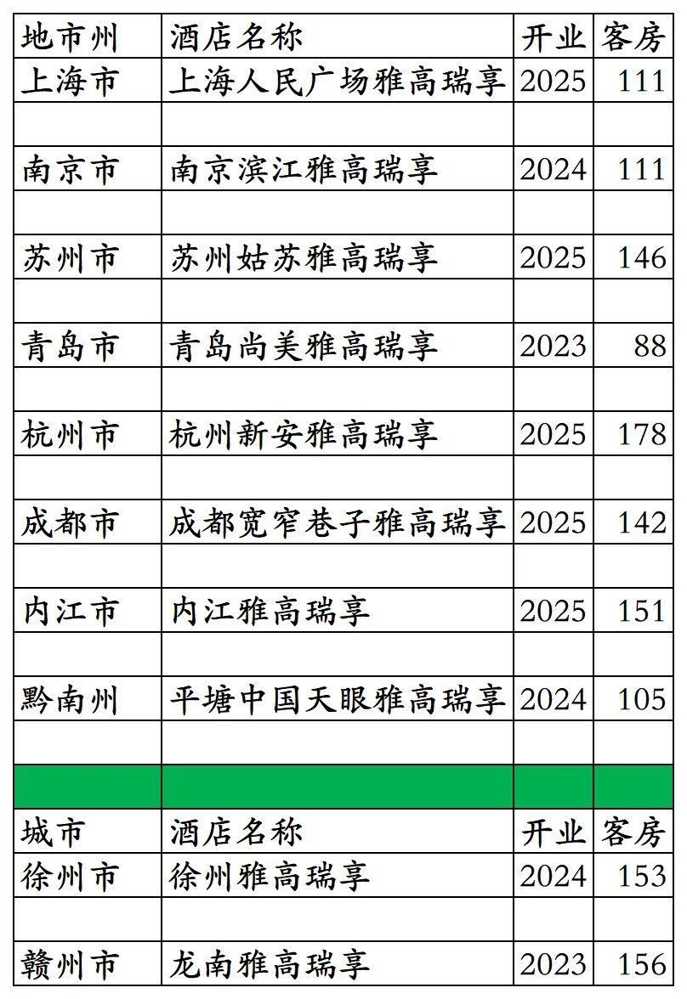
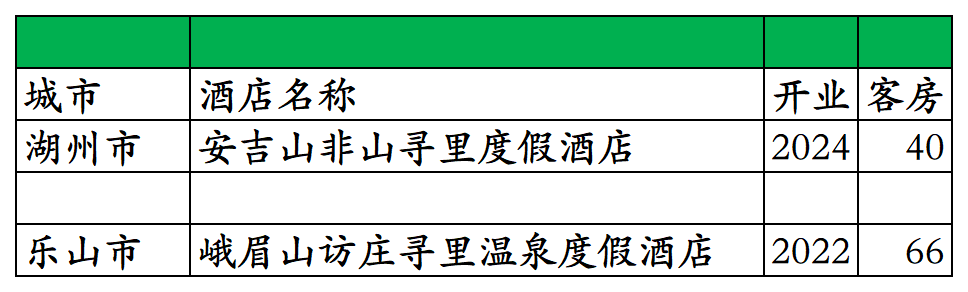
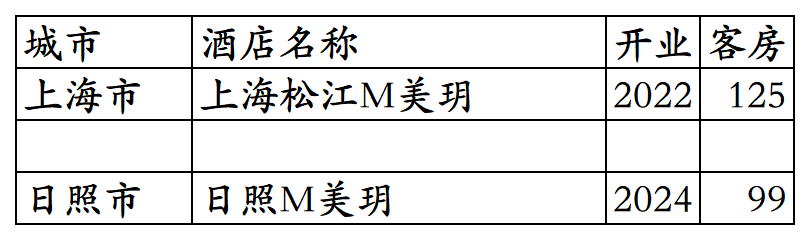
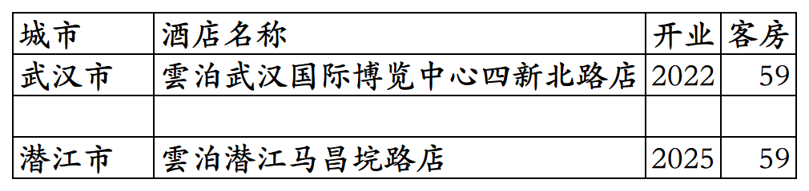

# 尚美高端品牌开业及退出酒店统计2025版

> **作者**：不同的角落  
> **发布时间**：2026年3月7日 22:37  
> **原文链接**：[尚美高端品牌开业及退出酒店统计2025版](https://mp.weixin.qq.com/s?__biz=MzU4OTczMzkwNw==&mid=2247611854&idx=1&sn=7a53dfe2b86a7ef9fd230ef7256cace3&scene=21#wechat_redirect)

---

尚美数智集团旗下高端品牌开业及退出酒店统计，统计数据截至2025年12月31日。

不含瑞享之前在国内开发运营的瑞享品牌酒店(瑞享在被雅高收购前开发的酒店，目前国内仅剩1家)。

不含雅高之前在国内开发运营的诗铂公寓(之前雅高仅开发运营1家，目前在营中)。

客房数据主要来自于尚美酒店官方平台与OTA，部分酒店客房数量打过酒店电话核实，记录的是酒店员工告知的客房数量。

尚美酒店旗下高端品牌有六象(目前无开业酒店)、美玥(目前2家酒店)、寻里(开业2家酒店目前都已退出)、雲泊(目前2家酒店)，特许经营的雅高酒店集团旗下瑞享品牌(雅高授权尚美特许经营后开发的瑞享品牌加挂雅高前缀为雅高瑞享，开业10家退出2家)、诗铂公寓(目前无)。

心里美会员计划，分为V1小美卡、V2小美银卡、V3小美金卡、V4小美钻卡/黑卡/雷神卡四个等级。

目前尚美高端品牌酒店在上海、江苏、山东、浙江、湖北、四川、贵州有酒店。

开业：新酒店开业或是其它酒店翻牌加入时间；

客房：客房数量。

个人精力有限，部分酒店开业/退出/下线时间以及客房数量难免有错误，欢迎各位告知指正，谢谢！

雅高瑞享品牌开业及退出酒店。

已退出的2家寻里品牌酒店。

美玥品牌2家酒店。

雲泊品牌2家酒店，雲泊酒店为尚美加盟商与尚美共创品牌，在潜江还有1家雲泊酒店潜江高铁站生态龙虾城店，非尚美旗下雲泊品牌。

**其它国内酒店集团开业酒店统计**：

01、锦江国内高端酒店开业及退出统计

[锦江国内高端酒店开业及退出统计2025版](https://mp.weixin.qq.com/s?__biz=MzU4OTczMzkwNw==&mid=2247609898&idx=1&sn=1bf95d3afb9ca7c4c201c8844fb7be47&scene=21#wechat_redirect)

02、华住国内高端酒店开业及退出统计

[华住国内高端酒店开业及退出统计2025版](https://mp.weixin.qq.com/s?__biz=MzU4OTczMzkwNw==&mid=2247606873&idx=1&sn=68d0d9a13b1fd7c801ba71d81d56c9fa&scene=21#wechat_redirect)

03、首旅高端品牌开业及退出酒店统计

[首旅高端品牌开业及退出酒店统计2025版](https://mp.weixin.qq.com/s?__biz=MzU4OTczMzkwNw==&mid=2247611828&idx=1&sn=72e09a8226c499e4f1bb6a9092c8fcb4&scene=21#wechat_redirect)

04、格林高端品牌开业及退出酒店统计

[格林高端品牌开业及退出酒店统计2025版](https://mp.weixin.qq.com/s?__biz=MzU4OTczMzkwNw==&mid=2247611836&idx=1&sn=964da1e90a749087b6734d2c8bbdf280&scene=21#wechat_redirect)

05、东呈高端酒店开业及退出统计

[东呈高端酒店开业及退出统计2025版](https://mp.weixin.qq.com/s?__biz=MzU4OTczMzkwNw==&mid=2247609471&idx=1&sn=3f9b86e6bb44de42272efdb69f66966f&scene=21#wechat_redirect)

06、开元开业及退出酒店统计

[开元开业及退出酒店统计2025版](https://mp.weixin.qq.com/s?__biz=MzU4OTczMzkwNw==&mid=2247607605&idx=1&sn=b497ea72bace78160605c89c0b16bfa9&scene=21#wechat_redirect)

07、万达开业及退出酒店统计

[万达开业及退出酒店统计2025版](https://mp.weixin.qq.com/s?__biz=MzU4OTczMzkwNw==&mid=2247607837&idx=1&sn=fa333c513bfaaa4c680f27e130ae2132&scene=21#wechat_redirect)

08、君亭开业及退出酒店统计

[君亭开业及退出酒店统计2025版](https://mp.weixin.qq.com/s?__biz=MzU4OTczMzkwNw==&mid=2247593231&idx=1&sn=e77507548dc06ec4350502f21ad6b17f&scene=21#wechat_redirect)

09、雷迪森开业及退出酒店统计

[雷迪森开业及退出酒店统计2025版](https://mp.weixin.qq.com/s?__biz=MzU4OTczMzkwNw==&mid=2247611063&idx=1&sn=4d963acb21a83c6fc1caa1050de3badd&scene=21#wechat_redirect)

10、凤悦开业及退出酒店统计

[凤悦开业及退出酒店统计2025版](https://mp.weixin.qq.com/s?__biz=MzU4OTczMzkwNw==&mid=2247610996&idx=1&sn=9771839fa64947b727044b9dd070ac86&scene=21#wechat_redirect)

11、中旅国内开业及退出酒店统计

[中旅国内开业及退出酒店统计2025版](https://mp.weixin.qq.com/s?__biz=MzU4OTczMzkwNw==&mid=2247577094&idx=1&sn=fd7d1711998de8f9bcbb32dd52ef7f3f&scene=21#wechat_redirect)

12、金陵开业及退出酒店统计

[金陵开业及退出酒店统计2025版](https://mp.weixin.qq.com/s?__biz=MzU4OTczMzkwNw==&mid=2247576523&idx=1&sn=243a19d77fcfb36bf194c97cc182834b&scene=21#wechat_redirect)

13、格兰云天开业及退出酒店统计

[格兰云天开业及退出酒店统计2025版](https://mp.weixin.qq.com/s?__biz=MzU4OTczMzkwNw==&mid=2247579183&idx=1&sn=5a1fea0a80f62d8e92af07c25e0c1c1d&scene=21#wechat_redirect)

14、中维开业及退出酒店统计

[中维开业及退出酒店统计2025版](https://mp.weixin.qq.com/s?__biz=MzU4OTczMzkwNw==&mid=2247581530&idx=1&sn=72add848f0fb5f82831f2d46855ee507&scene=21#wechat_redirect)

15、华天开业及退出酒店统计

[华天开业及退出酒店统计2025版](https://mp.weixin.qq.com/s?__biz=MzU4OTczMzkwNw==&mid=2247583997&idx=1&sn=46d5ab82f71c6249eb3f811ec108a794&scene=21#wechat_redirect)

16、凯莱开业及退出酒店统计

[凯莱开业及退出酒店统计2025版](https://mp.weixin.qq.com/s?__biz=MzU4OTczMzkwNw==&mid=2247611049&idx=1&sn=bf910cbfed36554af7ec82ad3196cf20&scene=21#wechat_redirect)

17、绿地开业及退出酒店统计

[绿地开业及退出酒店统计2025版](https://mp.weixin.qq.com/s?__biz=MzU4OTczMzkwNw==&mid=2247611758&idx=1&sn=04c4aacebb06c3a01883f452c18aad52&scene=21#wechat_redirect)

18、厦门建发开业及退出酒店统计

[厦门建发开业及退出酒店统计2025版](https://mp.weixin.qq.com/s?__biz=MzU4OTczMzkwNw==&mid=2247610581&idx=1&sn=397cee1f3684486c32ebeb215249ffce&scene=21#wechat_redirect)

19、厦门佰翔开业及退出酒店统计

[厦门佰翔开业及退出酒店统计2025版](https://mp.weixin.qq.com/s?__biz=MzU4OTczMzkwNw==&mid=2247579739&idx=1&sn=89912fcad6eab52a875ba40260bdef98&scene=21#wechat_redirect)

20、福建旅发开业及退出酒店统计

[福建旅发开业及退出酒店统计2025版](https://mp.weixin.qq.com/s?__biz=MzU4OTczMzkwNw==&mid=2247576672&idx=1&sn=bcbdf134ca973ca406d8e5d572069de3&scene=21#wechat_redirect)

21、远洲旅业开业及退出酒店统计

[远洲旅业开业及退出酒店统计2025版](https://mp.weixin.qq.com/s?__biz=MzU4OTczMzkwNw==&mid=2247576868&idx=1&sn=a5fc7218eb9630362828b884a61f4d6d&scene=21#wechat_redirect)

22、乔治莫兰迪开业酒店统计

[乔治莫兰迪开业酒店统计2025版](https://mp.weixin.qq.com/s?__biz=MzU4OTczMzkwNw==&mid=2247590594&idx=1&sn=ccb2ef8da02e866e2706c5dffced1fbd&scene=21#wechat_redirect)

更多的国内酒店统计、年度酒店排行、酒店常识、酒店行业资讯、酒店集团、航空常识、沈阳旅游、沙发客、打油诗等相关内容可以到我的微信公众号里查看。

也欢迎大家关注我的微信公众号和视频号，名称都是：**不同的角落**

微信直接搜索不同的角落就可以搜索到。

也可以直接点开下方公众号名片关注。