


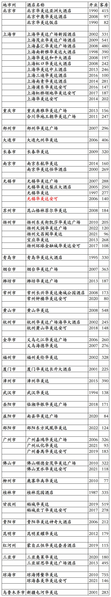

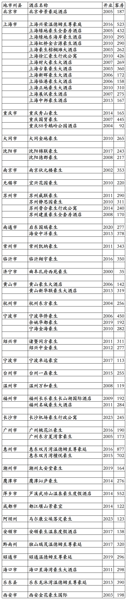

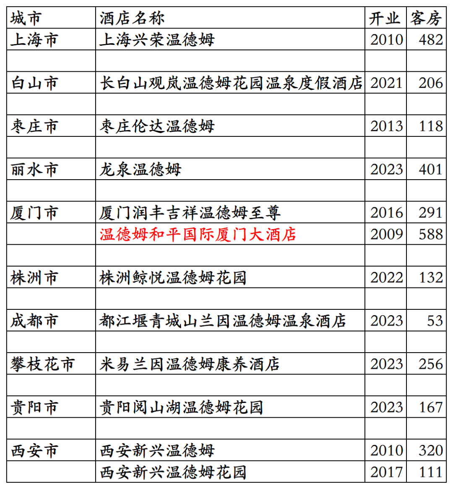
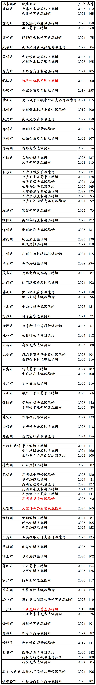
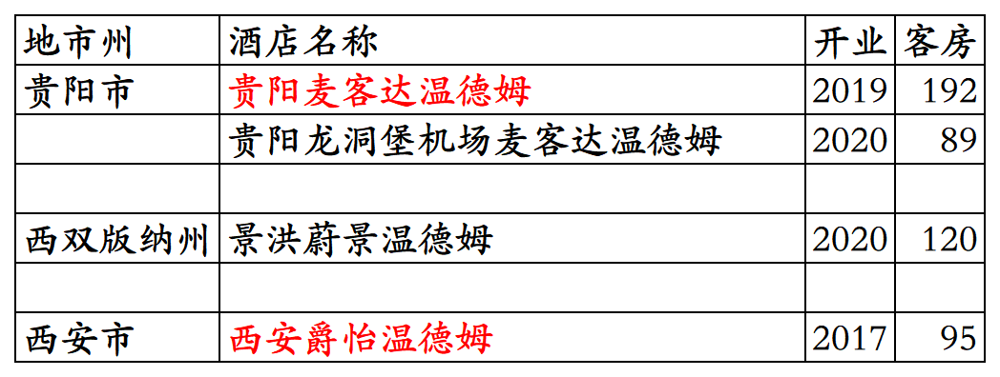

# 温德姆国内开业及退出酒店统计2025版

> **作者**：不同的角落  
> **发布时间**：2026年3月15日 23:54  
> **原文链接**：[温德姆国内开业及退出酒店统计2025版](http://mp.weixin.qq.com/s?__biz=MzU4OTczMzkwNw==&mid=2247612053&idx=1&sn=fb2c0fcda091a175b9f461449f55e95e&chksm=fdca7fe9cabdf6ff481b563920d0a937f0800ba748407a9ded25bc063d2eb81bbaca92e22601)

---

温德姆酒店集团国内开业及退出酒店统计，统计数据截至2025年12月31日。

不含速8中国旗下800多家速8系列品牌酒店。自2025年二季度起，由于速8中国特许经营协议存在问题，温德姆已不再将速8中国旗下酒店数量、客房数量、营收等纳入公司统计报表。

HFS→胜腾(圣达特)→温德姆。

温德姆在中国，简直就是神一样的存在。

万豪旗下福朋喜来登、希尔顿旗下希尔顿逸林、洲际旗下假日这三个品牌在国内被拔高有挂牌五星级酒店已经很神奇了。

温德姆旗下华美达广场、华美达、豪生这三个品牌在国内普遍被拔高多家酒店都是挂牌五星级酒店。

更神奇的是经济品牌戴斯，美国戴斯酒店集团(中国)在国内开发运营的戴斯酒店基本都是四星级到五星级全服务酒店，在国内注册了DaysHotel&Suites(五星级档次)、DaysHotel(四星级档次)、DaysInnBusinessPlace(商务酒店)、DaysInn(三星)、DaysSuites(酒店式公寓)五个五星级到三星级戴斯系列品牌，其中几十家戴斯酒店都是有泳池、行政酒廊、全日制餐厅的五星级档次全服务酒店，并且当初国内很多家戴斯都是挂牌五星级酒店(现在貌似已经没有了，估计那些业主终于知道戴斯品牌原本是什么档次了，不好意思再让酒店再过五星级酒店复核)。

另外蔚景温德姆、拉昆塔温德姆、爵怡温德姆、浩枫温德姆、美吟温德姆、戴斯温德姆等品牌都不是温德姆品牌，都只是原品牌名加了温德姆后缀，都只是温德姆酒店集团旗下中档酒店品牌。

就像万豪旗下万枫酒店品牌，现在都改成了万豪万枫酒店品牌一样。

温德姆旗下酒店品牌国内开发管理公司，之前有五家，现在还剩三家。

一家是特许经营速8的速伯艾特(北京)国际酒店管理有限公司，把经济酒店Super 8品牌做成了速8、速8优选、速8精选、Super悦、Super国际等多个品牌，涵盖经济到中高档。有单独的速8会员计划。Super 8是1993年HFS收购经济型汽车旅馆品牌。

一家是特许经营戴斯的美国戴斯集团(中国)，国内经营主体是新加坡华人陈嘉财成立的辅特(上海)酒店管理有限公司，获得经济酒店Days Inn中国特许经营权后(之前Days Inn品牌国内中文名为“天天酒店”，仅开出3家酒店)，中文名改为戴斯，拔高为三星级到五星级全服务酒店和公寓，以四星级、五星级档次的全服务酒店为主，后来又推出了中档有限服务酒店品牌辅特戴斯。有单独的美国戴斯酒店集团(中国)会员计划。后经营不善，2018年11月，温德姆酒店集团回购戴斯(中国)酒店集团，接手戴斯品牌中国业务。Days Inn是1992年HFS收购的经济型汽车旅馆品牌。

一家是香港大中华酒店集团，国内运营主体是上海豪生酒店管理有限公司，在国内特许经营豪生品牌酒店和只在中国才有的豪生系列豪宜、豪生Life、豪生Club品牌酒店，只在中国才有的温德姆至尊豪廷品牌酒店。有单独的豪廷会会员计划。豪生是1990年HFS收购的由汽车旅馆发展起来的多档次酒店品牌。

一家是之前万豪旗下的华美达环球，旗下有华美达广场、华美达、华美达安可三个品牌。2004年胜腾收购华美达全球特许经营业务(胜腾之前于1990年和2002年收购了华美达美国和华美达加拿大特许经营业务)，2005年收购华美达品牌所有权后，国内华美达酒店业务归属温德姆旗下。

一家是温德姆酒店集团，国内经营主体是温德姆酒店管理(北京)有限公司。目前开发温德姆系列品牌、华美达系列品牌、戴斯品牌和其它品牌。

其它品牌包括HFS1996年推出的蔚景、2006年胜腾收购的美吟、2008年温德姆收购的浩枫和麦客达、2010年收购的爵怡、2018年收购的拉昆塔，2018年温德姆将这些品牌都加上后缀温德姆。

客房数据主要来自于温德姆酒店官方平台与OTA，部分酒店客房数量打过酒店电话核实，记录的是酒店员工告知的客房数量。

温德姆奖赏会员计划，分为蓝卡、金卡、白金卡、钻石卡四个等级。

目前温德姆旗下品牌酒店在国内31个省市区都有酒店。

很多酒店未上线温德姆官方平台，一些温德姆品牌酒店退出后目前尚未更名。

开业：新酒店开业或是其它酒店翻牌加入时间；

客房：客房数量。

个人精力有限，部分酒店开业/退出/下线时间以及客房数量难免有错误，部分退出/关停酒店有遗漏，烦请各位告知指正，谢谢！

戴斯品牌开业在营168家酒店。不含已翻牌为温德姆其它品牌的原戴斯酒店。酒店名称红色为五星级档次全服务酒店。现在的苏州戴斯酒店是原来的苏州辅特戴斯酒店。

已退出/关停戴斯酒店，酒店名称红色为五星级档次全服务酒店，北京长安戴斯大酒店是原2013年开业的北京长安大酒店，2004年加盟戴斯，重庆戴斯大酒店现在是已停业的重庆天来大酒店，朔州戴斯大酒店现在是朔州四季平朔酒店，安阳昊澜戴斯大酒店现在是安阳迎宾馆，苏州戴斯酒店现在是和颐至格。

华美达系列品牌开业在营195家酒店。不含已翻牌为温德姆其它品牌的原华美达系列品牌酒店。北京明豪华美达酒店为原北京明豪戴斯酒店翻牌，另多家华美达广场品牌酒店是原华美达品牌酒店升级。

已退出/关停华美达系列品牌酒店，上海华美达广场新园酒店现在是希尔顿花园，上海茂业华美达广场酒店现在是万枫，上海华美达和平大酒店现在是亚朵S。

温德姆至尊豪廷和豪生系列品牌开业在营酒店138家。北京宝辰饭店2001年签约豪生管理，但是一直未挂豪生品牌。济源宏安豪生酒店是原济源泰宏天安戴斯大酒店翻牌。

已退出/关停温德姆至尊豪廷和豪生系列品牌。

温德姆系列品牌开业在营酒店157家，天津京津新城温德姆至尊酒店是原凯悦酒店，信阳温德姆酒店是原锦江酒店，无锡温德姆花园酒店是原戴斯酒店，南平中都温德姆酒店是原华美达广场酒店。

已退出/关停温德姆系列品牌酒店。

温德姆旗下其它品牌开业在营85家酒店。酒店名字红色为品牌国内首店。

已退出/关停温德姆旗下其它品牌酒店。酒店名字红色为品牌国内首店。

**其它国际酒店集团国内开业酒店统计**：

01、凯宾斯基国内开业及退出酒店统计

[凯宾斯基国内开业及退出酒店统计2025版](https://mp.weixin.qq.com/s?__biz=MzU4OTczMzkwNw==&mid=2247576218&idx=1&sn=297877d418eba4a8c30a260e966bbce6&scene=21#wechat_redirect)

02、雅阁国内开业及退出酒店统计

[雅阁国内开业及退出酒店统计2025版](https://mp.weixin.qq.com/s?__biz=MzU4OTczMzkwNw==&mid=2247606646&idx=1&sn=06f16fecc46574c51e4e3d2e82d28cd4&scene=21#wechat_redirect)

更多的国内酒店统计、年度酒店排行、酒店常识、酒店行业资讯、酒店集团、航空常识、沈阳旅游、沙发客、打油诗等相关内容可以到我的微信公众号里查看。

也欢迎大家关注我的微信公众号和视频号，名称都是：**不同的角落**

微信直接搜索不同的角落就可以搜索到。

也可以直接点开下方公众号名片关注。