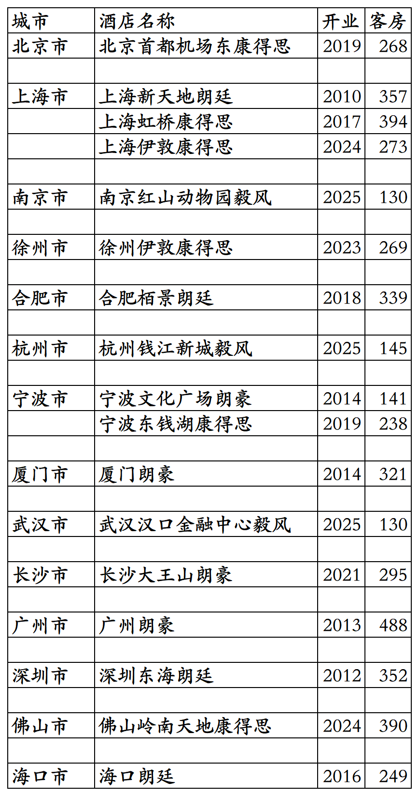

# 朗廷国内开业酒店统计2025版

> **作者**：不同的角落  
> **发布时间**：2026年3月21日 23:22  
> **原文链接**：[朗廷国内开业酒店统计2025版](http://mp.weixin.qq.com/s?__biz=MzU4OTczMzkwNw==&mid=2247612286&idx=1&sn=db2bd24279c9945df7f897a701c6ec36&chksm=fdca7e02cabdf7141f92a1c2aeda36bb0168f5ea6f66512ab357075674aabb4eb35abab2c312)

---

朗廷酒店集团旗下国内开业酒店统计，统计数据截至2025年12月31日。

客房数据主要来自于朗廷官方平台与OTA，部分酒店客房数量打过酒店电话核实，记录的是酒店员工告知的客房数量。

朗廷旗下目前有朗廷、朗豪、康得思、毅风等酒店品牌。

朗廷卓逸会会员计划，会员等级分为玛瑙、托帕石、钻石、蓝宝石、红宝石五个等级。

截至2025年12月31日在朗廷官方平台和OTA平台可以查询到的朗廷旗下品牌国内开业在营酒店共计17家客房4779间。

目前朗廷旗下品牌在北京、上海、江苏、安徽、浙江、福建、湖北、湖南、广东、海南有酒店。

开业：新酒店开业或是其它酒店翻牌开业时间；

客房：客房数量。

个人精力有限，部分酒店开业/退出/下线时间以及客房数量难免有错误，欢迎各位告知指正，谢谢！

国内17家开业在营酒店。

**其它港澳台酒店集团开业酒店统计**：

01、香格里拉开业及退出酒店统计

[香格里拉开业及退出酒店统计2025版](https://mp.weixin.qq.com/s?__biz=MzU4OTczMzkwNw==&mid=2247584908&idx=1&sn=a0e56396b3768294dd4b6b6c69d1f31d&scene=21#wechat_redirect)

02、瑰丽开业酒店统计

[瑰丽开业酒店统计2025版](https://mp.weixin.qq.com/s?__biz=MzU4OTczMzkwNw==&mid=2247610591&idx=1&sn=5df731aabe88049aa0eb517d6a3bb641&scene=21#wechat_redirect)

03、九龙仓开业及退出酒店统计

[九龙仓开业及退出酒店统计2025版](https://mp.weixin.qq.com/s?__biz=MzU4OTczMzkwNw==&mid=2247611815&idx=1&sn=4fdaf8733cf5cf5bbb1a2e9c1d2d4d43&scene=21#wechat_redirect)

更多的酒店统计、年度酒店排行、酒店常识、酒店行业资讯、酒店集团、航空常识、沈阳旅游、沙发客、打油诗等相关内容可以到我的微信公众号里查看。

也欢迎大家关注我的微信公众号和视频号，名称都是：**不同的角落**

微信直接搜索不同的角落就可以搜索到。

也可以直接点开下方公众号名片关注。