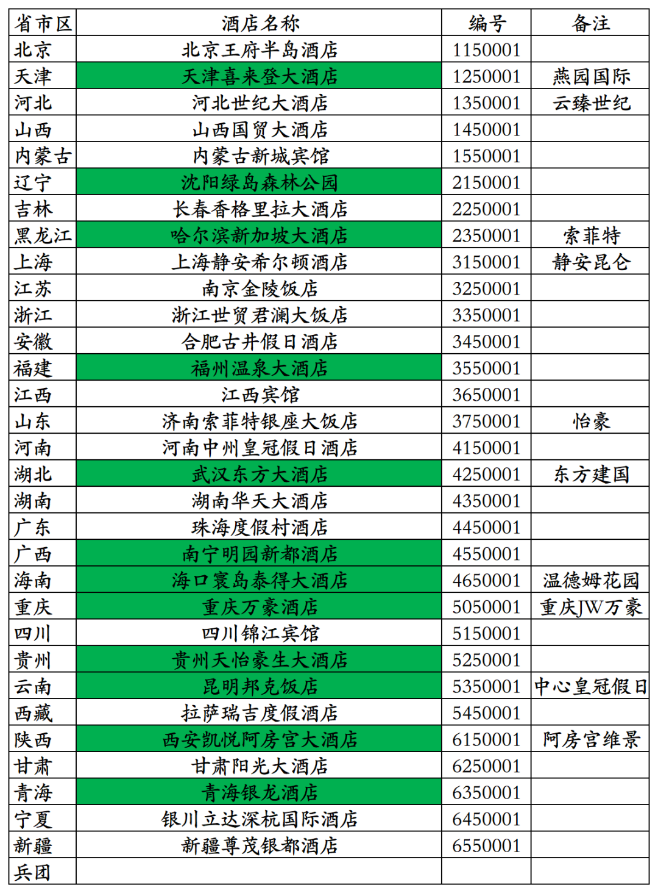
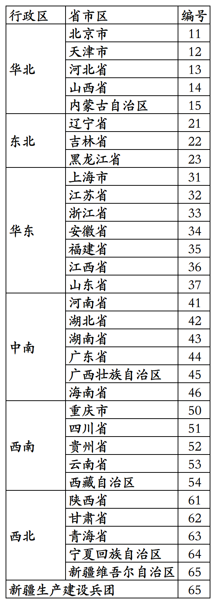
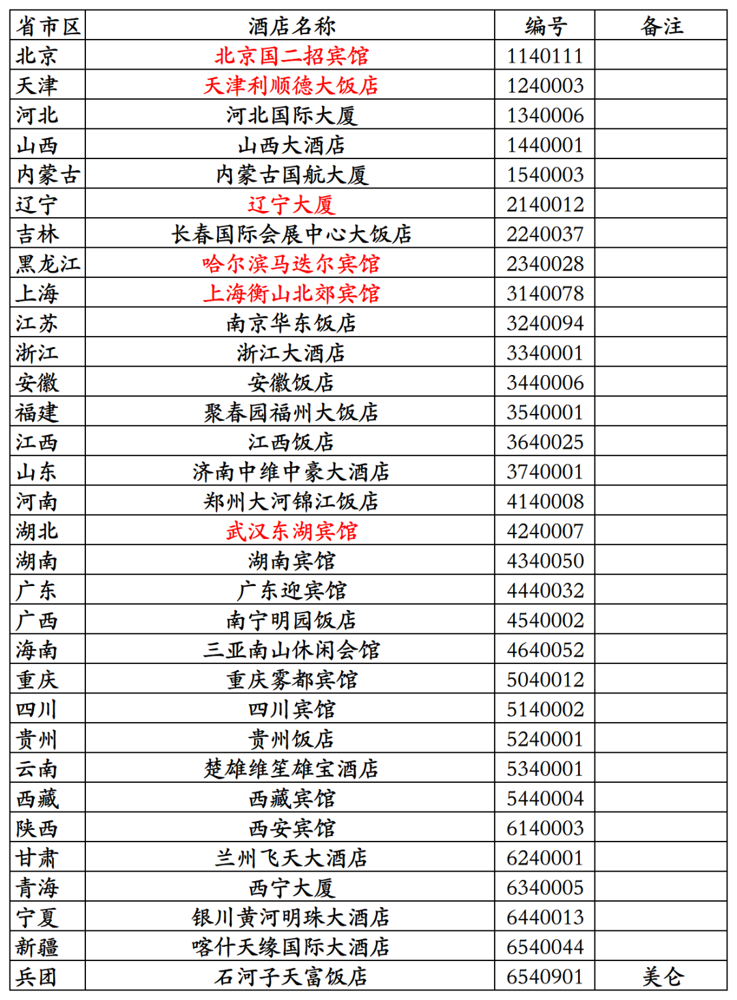
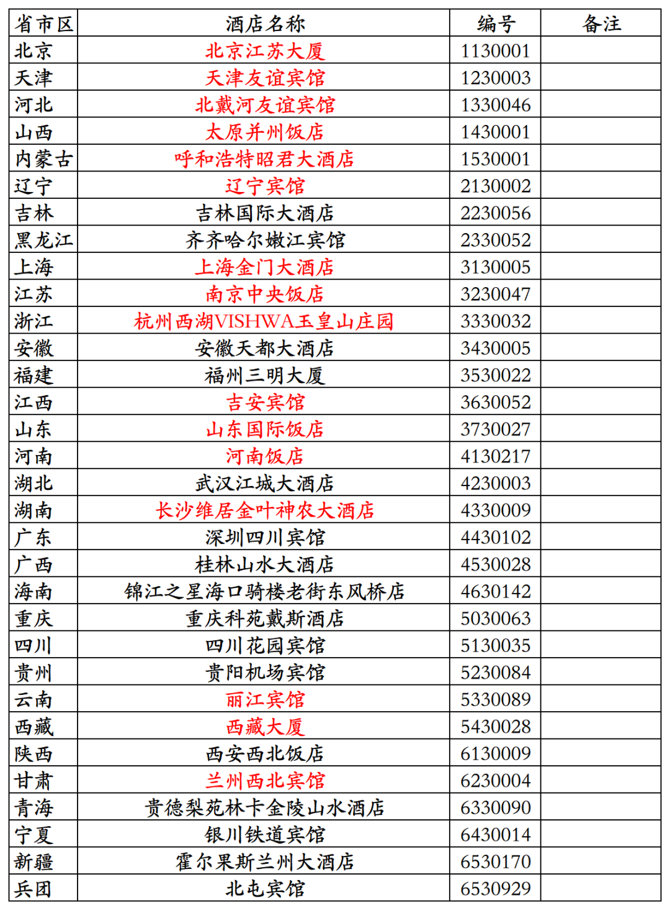
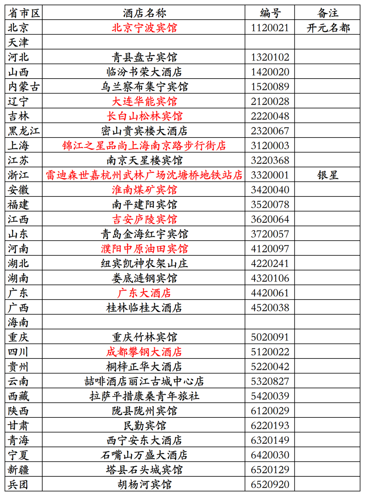
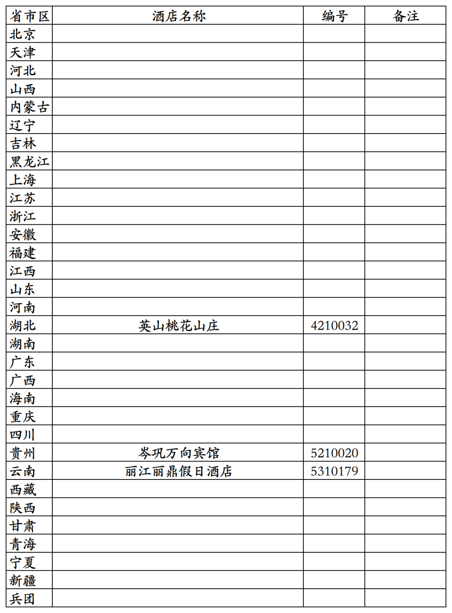

# 酒店常识之六国内星级旅游饭店标牌号

> **作者**：不同的角落  
> **发布时间**：2026年3月29日 23:18  
> **原文链接**：[酒店常识之六国内星级旅游饭店标牌号](http://mp.weixin.qq.com/s?__biz=MzU4OTczMzkwNw==&mid=2247612339&idx=1&sn=708a3e87bb2a45c64cfb7173807c222b&chksm=fdca7ecfcabdf7d90f2de3ea8480bfe3311a6b5045e8ac66fea36681049037c165fe27840d76)

---

这几天，统计了一下国内31个省、直辖市、自治区的编号为0001的五星级饭店。

新疆生产建设兵团目前尚无挂牌五星级酒店，胡杨河开元名庭大酒店目前正在申评五星级旅游饭店。

统计出的名单如下：

下图表格中绿色底纹的是已经摘星的原五星级饭店。

天津喜来登大酒店是天津市第一家挂牌五星级饭店，现在是天津燕园国际大酒店。

沈阳绿岛森林公园是辽宁省沈阳市第一家挂牌五星级饭店，现在沈阳城市学院。

哈尔滨新加坡大酒店是黑龙江省哈尔滨市第一家挂牌五星级酒店，现在是哈尔滨索菲特大酒店。

福州温泉大酒店是福建省福州市第一家挂牌五星级饭店，2015年已拆除。

武汉东方大酒店是湖北省武汉市第一家挂牌五星级饭店，后来曾翻牌城市名人酒店集团旗下城市名人品牌，最后又翻牌首旅旗下建国品牌，2025年已停业。

南宁明园新都酒店是广西壮族自治区南宁市第一家挂牌五星级饭店，位于南宁明园饭店院内，酒店占用土地是南宁明园饭店的，算是南宁明园饭店合资项目。2020年南宁明园新都酒店停业，2022年南宁明园饭店通过参与司法竞拍，拍下南宁明园新都酒店大楼，目前正在进行优化改造。

海口寰岛泰得大酒店是海南省海口市第一家挂牌五星级饭店，现在是温德姆旗下温德姆花园品牌酒店。

重庆万豪酒店是重庆市第一家挂牌五星级饭店，1999年开业，2004年升级为JW万豪酒店，2014年酒店停业。现在的重庆JW万豪酒店是2014年新开业的另一家酒店。

贵州天怡豪生大酒店是贵州省贵阳市第一家挂牌五星级饭店，2022年摘星。

昆明邦克酒店是云南省昆明市第二家挂牌五星级饭店，2014年翻牌为洲际旗下昆明中心皇冠假日酒店。

西安凯悦阿房宫大酒店是陕西省西安市第一家挂牌五星级饭店，1990年开业，2011年翻牌为港中旅旗下西安阿房宫维景国际大酒店。2016年9月摘星后挂牌出售。新长安实业公司接手后改造成新长安妇产医院，于2019年6月开业，2025年破产重整。

青海银龙酒店是青海省西宁市第一家挂牌五星级饭店，2017年摘星。

上海静安希尔顿酒店于1990年获评五星级饭店，是国内首批三家五星级饭店之一。

银川立达深杭国际酒店于2025年5月获评为五星级饭店，是宁夏回族自治区第二家五星级饭店。

济南索菲特银座大饭店已翻牌为山东文旅旗下自有品牌怡豪。

国内星级旅游饭店标牌号前两位数字，对应是是酒店所在地归属的省级行政区区划代码，也就是酒店所在地居民身份证号码前两位数字。

具体如下：

国内星级旅游饭店标牌号第三位数字，对应的是酒店星级，5、4、3、2、1。

可以对照看下国内现有的31个省、直辖市、自治区和新疆生产建设兵团挂牌一星级至四星级饭店名录中的部分星级饭店名单和对应星级饭店标牌号，名录中部分酒店目前停业中。

挂牌四星级饭店，哈尔滨马迭尔宾馆目前停业中。

挂牌三星级饭店，西藏大厦目前停业改造中，改造后有可能会申评四星级。

挂牌二星级饭店，目前天津市和海南省已无挂牌二星级饭店，之前的二星级饭店都已摘星。

北京宁波宾馆已完成翻新改造，已于今年重新恢复营业，在百达屋平台被加挂了开元名都后缀，被划分到开元名都酒店品牌，酒店目前应该有五星级档次，但酒店目前仍只是挂牌二星级旅游饭店。

挂牌一星级饭店，现在挂牌一星级饭店且营业中的已经没有几家，英山桃花山庄也已于今年停业。

现在是五星级档次、挂牌四星级的北京国二招宾馆(国家机关事务管理局宾馆管理中心旗下酒店，原国务院第二招待所)1990年刚评星时，是一星级涉外旅游饭店。

比上海和平饭店资历还老的上海浦江饭店(现在是中国证券博物馆)，1990年刚评星时，也是一星级涉外旅游饭店。

更多的酒店常识、酒店统计、年度酒店排行、酒店行业资讯、酒店集团、航空常识、沈阳旅游、沙发客、打油诗等相关内容可以到我的微信公众号里查看。

也欢迎大家关注我的微信公众号和视频号，名称都是：**不同的角落**

微信直接搜索不同的角落就可以搜索到。

也可以直接点开下方公众号名片关注。