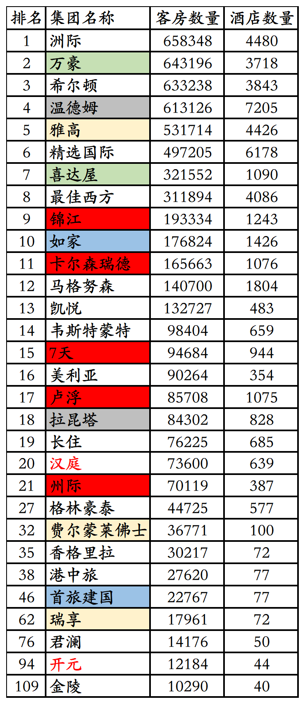
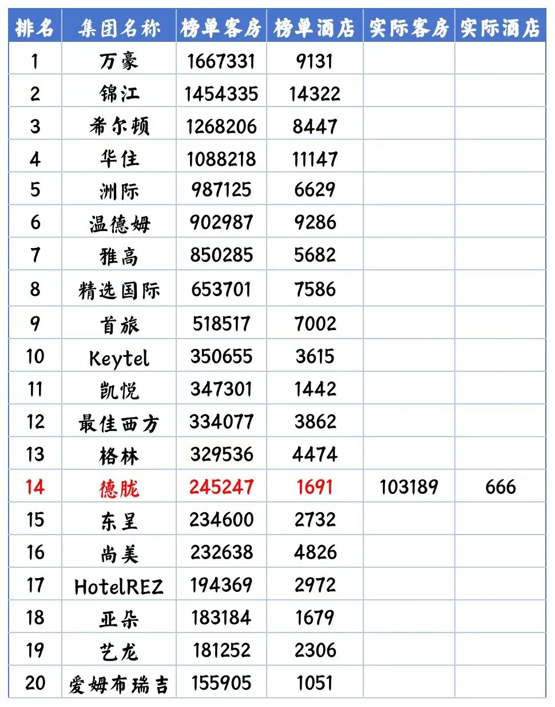
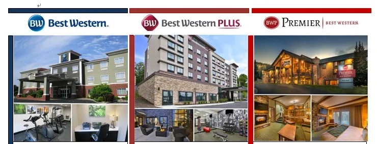
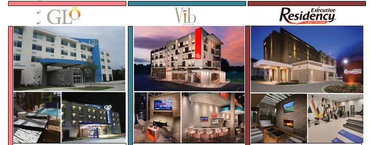
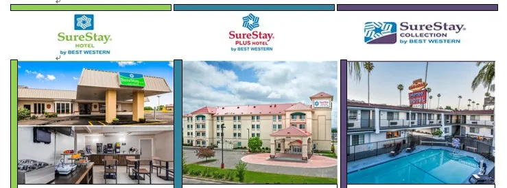
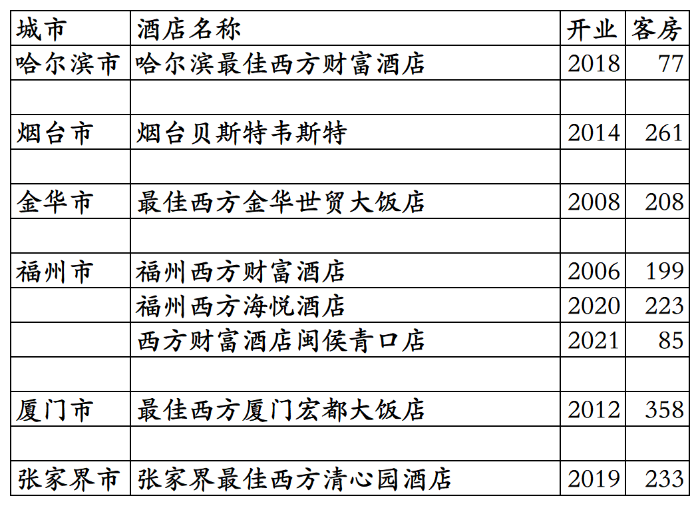
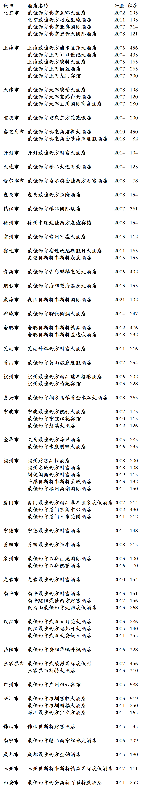

# 最佳西方国内开业及退出酒店统计2025版

> 本文转载自微信公众号 **不同的角落**，已获作者授权。  
> 原文发布于 2026年4月7日 21:56  
> 原文链接：[mp.weixin.qq.com](http://mp.weixin.qq.com/s?__biz=MzU4OTczMzkwNw==&mid=2247612615&idx=1&sn=2804fadc35666e4e60f282b44b84138b&chksm=fdca71bbcabdf8ad59e775f8c9d50ef1e043f979de49c87121f03d93cbef96bdadab653cccf2)

---

最佳西方(贝斯特韦斯特)酒店集团旗下国内开业酒店统计，统计数据截至2025年12月31日。不包括最佳西方收购的世尊酒店联盟旗下国内联盟合作酒店。

成立于1946年的国际酒店巨头最佳西方，2002年进入中国，初期在国内发展还可以，高峰期有几十家在营酒店，倒也匹配得上其全球前十大酒店集团的身份。

不过后期就像开了挂一样，当然是反向挂，最终就是国内酒店数量越来越少，目前已经不足10家，被凯悦、凯宾斯基、悦榕、雅阁、雅诗阁、地中海俱乐部、泛太平洋、千禧等国际连锁赶超。

十多年前在福州住过两家最佳西方酒店，现在一家已经退出，一家还在。

最佳西方酒店集团全球酒店数量和客房数量，最近20多年也是越开越少，2024年全球酒店客房数量首次被凯悦赶超，全球酒店集团排名也跌出全球前十。

最佳西方酒店集团在2003年、2004年、2011年、2013年、2023年、2024年全球酒店排名如下：

2003年4110家酒店310245间客房排名全球第七。

2004年4114家酒店309236间客房排名全球第七。

2011年4086家酒店311894间客房排名全球第八。

2013年4097家酒店317838间客房排名全球第八。

2023年3911家酒店339234间客房排名全球第十。

2024年3862家酒店334077间客房排名全球第十二。

最佳西方酒店集团更多年份全球排名可以看这篇：

[2003-2012全球酒店集团325强](https://mp.weixin.qq.com/s?__biz=MzU4OTczMzkwNw==&mid=2247514985&idx=1&sn=89156e4fa6f318c27c0d93b28a4e88cb&scene=21#wechat_redirect)

客房数据主要来自于OTA平台，部分酒店客房数量打过酒店电话核实，记录的是酒店员工告知的客房数量。

最佳西方旗下目前有包括下图品牌在内的10多个酒店品牌。

倍优客俱乐部会员计划，会员等级分为普卡、金卡、白金卡、钻石卡、黑钻卡五个等级。

截至2025年12月31日在最佳西方官方平台和OTA平台可以查询到的最佳西方旗下品牌国内开业在营酒店共计8家客房1644间。

哈尔滨西方财富酒店今年已经停业。

目前最佳西方旗下品牌在黑龙江、山东、浙江、福建、湖南有酒店。

开业：新酒店开业或是其它酒店翻牌开业时间；

客房：客房数量。

个人精力有限，部分酒店开业/退出/下线时间以及客房数量难免有错误，欢迎各位告知指正，谢谢！

国内8家开业在营酒店。

历年退出/关停酒店。

**其它国际酒店集团国内开业酒店统计**：

01、温德姆国内开业及退出酒店统计

[温德姆国内开业及退出酒店统计2025版](https://mp.weixin.qq.com/s?__biz=MzU4OTczMzkwNw==&mid=2247612053&idx=1&sn=fb2c0fcda091a175b9f461449f55e95e&scene=21#wechat_redirect)

02、凯宾斯基国内开业及退出酒店统计

[凯宾斯基国内开业及退出酒店统计2025版](https://mp.weixin.qq.com/s?__biz=MzU4OTczMzkwNw==&mid=2247576218&idx=1&sn=297877d418eba4a8c30a260e966bbce6&scene=21#wechat_redirect)

03、雅阁国内开业及退出酒店统计

[雅阁国内开业及退出酒店统计2025版](https://mp.weixin.qq.com/s?__biz=MzU4OTczMzkwNw==&mid=2247606646&idx=1&sn=06f16fecc46574c51e4e3d2e82d28cd4&scene=21#wechat_redirect)

04、千禧国内开业及退出酒店统计

[千禧国敦国内开业酒店统计2025版](https://mp.weixin.qq.com/s?__biz=MzU4OTczMzkwNw==&mid=2247576105&idx=1&sn=b9a2985fcef77d2fb4207884b3e3ffe0&scene=21#wechat_redirect)

更多的酒店统计、年度酒店排行、酒店常识、酒店行业资讯、酒店集团、航空常识、沈阳旅游、沙发客、打油诗等相关内容可以到我的微信公众号里查看。

也欢迎大家关注我的微信公众号和视频号，名称都是：**不同的角落**

微信直接搜索不同的角落就可以搜索到。

也可以直接点开下方公众号名片关注。