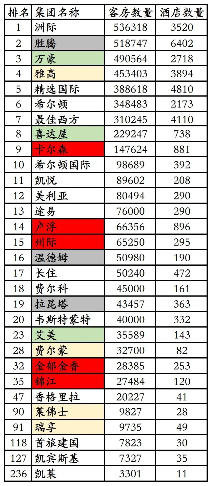
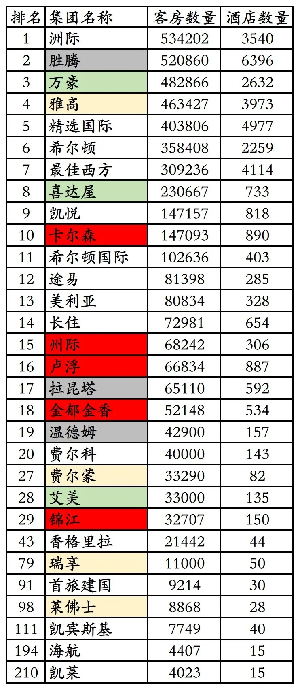
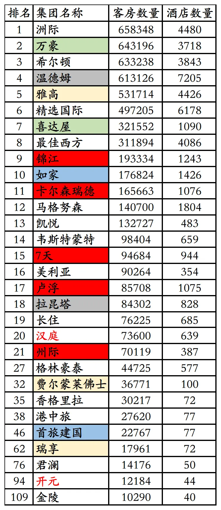
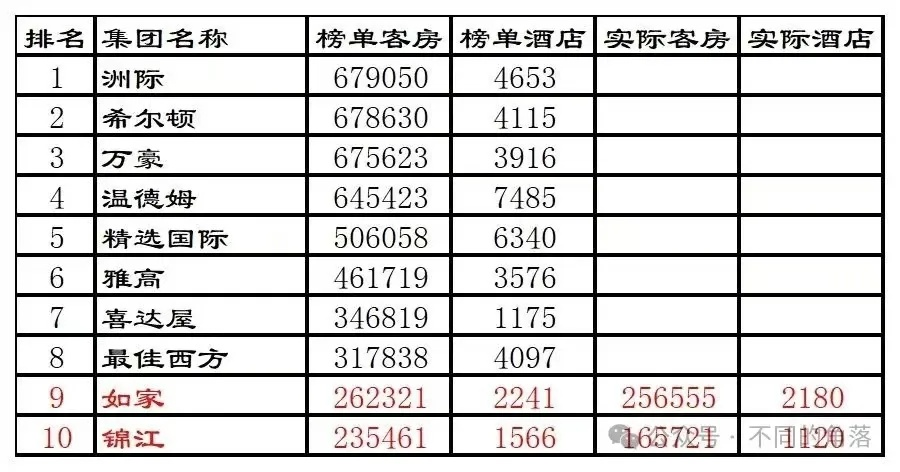
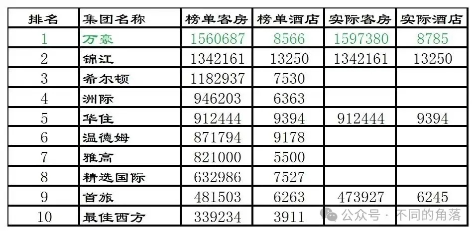
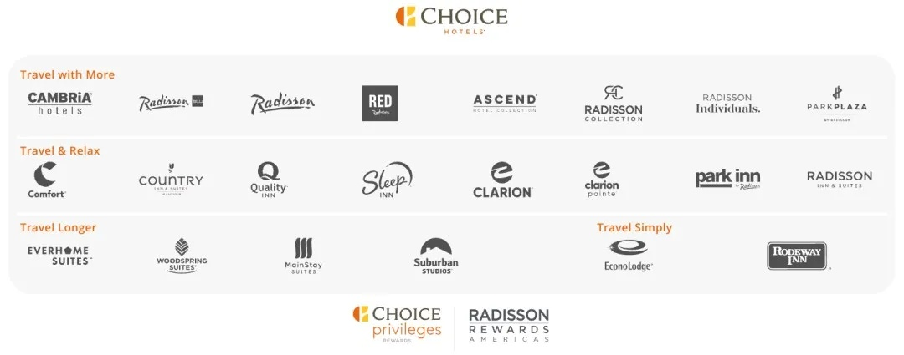
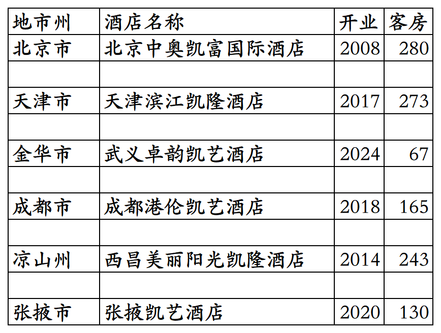
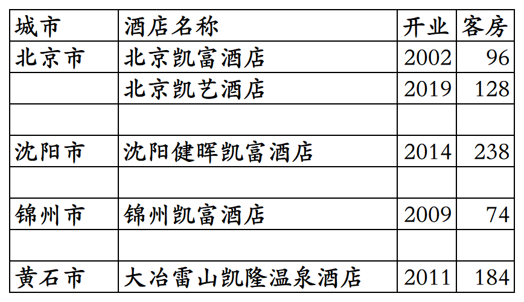

# 精选国际国内开业及退出酒店统计2025版

> **作者**：不同的角落  
> **发布时间**：2026年4月8日 23:49  
> **原文链接**：[精选国际国内开业及退出酒店统计2025版](http://mp.weixin.qq.com/s?__biz=MzU4OTczMzkwNw==&mid=2247612647&idx=1&sn=d26352a67735843c818b80c305831383&chksm=fdca719bcabdf88d19d8e49f38d82f22981b87941c1472310668ec3caff1039c0e928462157b)

---

精选国际酒店集团旗下国内开业酒店统计，统计数据截至2025年12月31日。

全球前十大酒店集团中，中国酒店业务做的最惨不忍睹的并不是最佳西方，而是比最佳西方成立时间更早、规模更大的精选国际酒店集团。

成立于1939年的国际酒店巨头精选国际，2002年在北京开出第一家酒店，之后就开始摆烂，几年间隔才开出下一家酒店。

精选国际酒店集团中国酒店增长速度，与其全球酒店增长速度完全不匹配。

另外在精选国际官方平台预订国内那几家酒店，房价基本都比OTA平台贵50%。

2025年才想起来跟万豪、希尔顿、雅高、凯悦学习在国内收小弟，新收的小弟君亭也不知道给力不给力。

精选国际酒店集团在2003年、2004年、2011年、2013年、2023年、2024年全球酒店排名如下：

2003年4810家酒店388618间客房排名全球第五。

2004年4977家酒店403806间客房排名全球第五。

2011年6178家酒店497205间客房排名全球第六。

2013年6340家酒店506058间客房排名全球第五。

2023年7527家酒店632986间客房排名全球第八。

2024年7586家酒店653701间客房排名全球第八。

精选国际酒店集团更多年份全球排名可以看这篇：

[2003-2012全球酒店集团325强](https://mp.weixin.qq.com/s?__biz=MzU4OTczMzkwNw==&mid=2247514985&idx=1&sn=89156e4fa6f318c27c0d93b28a4e88cb&scene=21#wechat_redirect)

精选国际旗下原本有凯隆、凯富、凯艺等10多个品牌，2022年收购锦江旗下美洲丽笙酒店业务后，旗下酒店品牌数量增加到20多个。

Choice Privileges会员计划，会员等级分为普卡、金卡、白金卡、钻石卡四个等级。精选国际旗下的草莓酒店和美洲丽笙，目前也都还有单独的会员计划。

截至2025年12月31日在精选国际官方平台和OTA平台可以查询到的精选国际旗下品牌国内开业在营酒店共计6家客房1158间。

客房数据主要来自于OTA平台，部分酒店客房数量打过酒店电话核实，记录的是酒店员工告知的客房数量。

目前精选国际旗下品牌在北京、天津、浙江、四川、甘肃有酒店。

开业：新酒店开业或是其它酒店翻牌开业时间；

客房：客房数量。

个人精力有限，部分酒店开业/退出/下线时间以及客房数量难免有错误，欢迎各位告知指正，谢谢！

国内6家开业在营酒店。天津滨江凯隆酒店是天津滨江万丽酒店翻牌。

历年退出/关停酒店。

**其它国际酒店集团国内开业酒店统计**：

01、温德姆国内开业及退出酒店统计

[温德姆国内开业及退出酒店统计2025版](https://mp.weixin.qq.com/s?__biz=MzU4OTczMzkwNw==&mid=2247612053&idx=1&sn=fb2c0fcda091a175b9f461449f55e95e&scene=21#wechat_redirect)

02、最佳西方国内开业及退出酒店统计

[最佳西方国内开业及退出酒店统计2025版](https://mp.weixin.qq.com/s?__biz=MzU4OTczMzkwNw==&mid=2247612615&idx=1&sn=2804fadc35666e4e60f282b44b84138b&scene=21#wechat_redirect)

03、凯宾斯基国内开业及退出酒店统计

[凯宾斯基国内开业及退出酒店统计2025版](https://mp.weixin.qq.com/s?__biz=MzU4OTczMzkwNw==&mid=2247576218&idx=1&sn=297877d418eba4a8c30a260e966bbce6&scene=21#wechat_redirect)

04、雅阁国内开业及退出酒店统计

[雅阁国内开业及退出酒店统计2025版](https://mp.weixin.qq.com/s?__biz=MzU4OTczMzkwNw==&mid=2247606646&idx=1&sn=06f16fecc46574c51e4e3d2e82d28cd4&scene=21#wechat_redirect)

05、千禧国内开业及退出酒店统计

[千禧国敦国内开业酒店统计2025版](https://mp.weixin.qq.com/s?__biz=MzU4OTczMzkwNw==&mid=2247576105&idx=1&sn=b9a2985fcef77d2fb4207884b3e3ffe0&scene=21#wechat_redirect)

更多的酒店统计、年度酒店排行、酒店常识、酒店行业资讯、酒店集团、航空常识、沈阳旅游、沙发客、打油诗等相关内容可以到我的微信公众号里查看。

也欢迎大家关注我的微信公众号和视频号，名称都是：**不同的角落**

微信直接搜索不同的角落就可以搜索到。

也可以直接点开下方公众号名片关注。