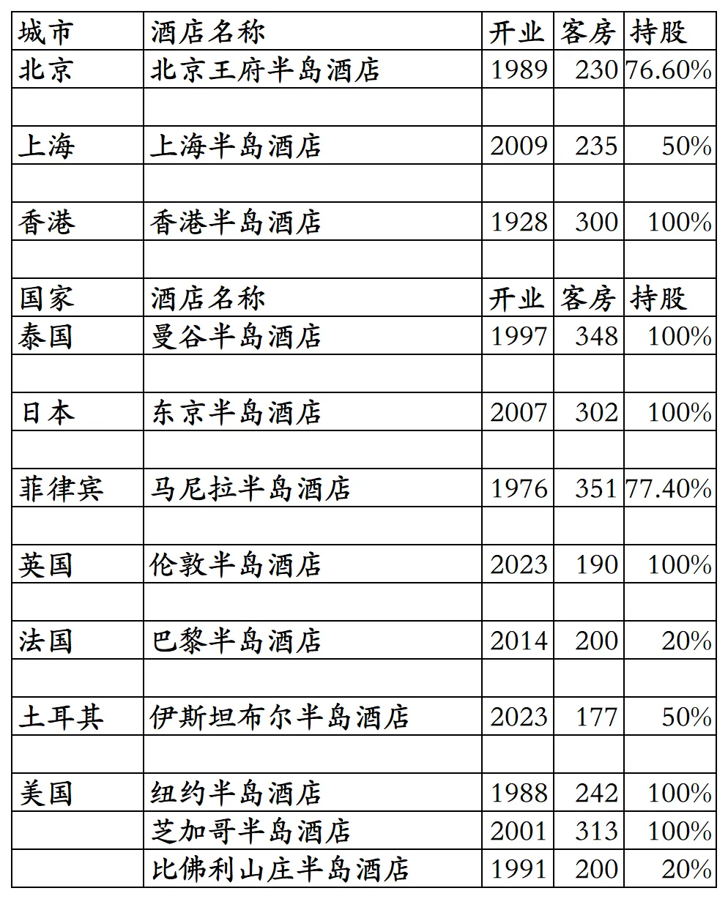

# 半岛开业酒店统计2025版

> 本文转载自微信公众号 **不同的角落**，已获作者授权。  
> 原文发布于 2026年4月20日 21:58  
> 原文链接：[mp.weixin.qq.com](http://mp.weixin.qq.com/s?__biz=MzU4OTczMzkwNw==&mid=2247612873&idx=1&sn=a8d36862bf5b2935fd7db99ab13b5cae&chksm=fdca70b5cabdf9a301f9c03336623bb2d42c44b059dff1dda0d4633e7bc465473bdaa725ce7a)

---

香港上海大酒店(半岛酒店集团)旗下开业酒店统计，统计数据截至2025年12月31日。

客房数据主要来自于半岛官方平台与OTA，部分酒店客房数量打过酒店电话核实，记录的是酒店员工告知的客房数量。

半岛旗下目前只有半岛酒店品牌。

半岛臻伴会员计划，半岛官方平台预订入住，大中华区半岛酒店入住享免费房型升级，另外还可享灵活的入住(最早6:00)及退房(最晚22:00)时间。

截至2025年12月31日在半岛官方平台和OTA平台可以查询到的半岛开业在营酒店共计12家客房3088间。12家酒店物业都是半岛全资持股或部分持股。

开业：新酒店开业或是其它酒店翻牌开业时间；

客房：客房数量。

个人精力有限，部分酒店开业/退出/下线时间以及客房数量难免有错误，欢迎各位告知指正，谢谢！

全球12家开业在营酒店。

**其它港澳台酒店集团开业酒店统计**：

01、香格里拉开业及退出酒店统计

[香格里拉开业及退出酒店统计2025版](https://mp.weixin.qq.com/s?__biz=MzU4OTczMzkwNw==&mid=2247584908&idx=1&sn=a0e56396b3768294dd4b6b6c69d1f31d&scene=21#wechat_redirect)

02、瑰丽开业酒店统计

[瑰丽开业酒店统计2025版](https://mp.weixin.qq.com/s?__biz=MzU4OTczMzkwNw==&mid=2247610591&idx=1&sn=5df731aabe88049aa0eb517d6a3bb641&scene=21#wechat_redirect)

03、朗廷国内开业酒店统计

[朗廷国内开业酒店统计2025版](https://mp.weixin.qq.com/s?__biz=MzU4OTczMzkwNw==&mid=2247612286&idx=1&sn=db2bd24279c9945df7f897a701c6ec36&scene=21#wechat_redirect)

04、九龙仓开业及退出酒店统计

[九龙仓开业及退出酒店统计2025版](https://mp.weixin.qq.com/s?__biz=MzU4OTczMzkwNw==&mid=2247611815&idx=1&sn=4fdaf8733cf5cf5bbb1a2e9c1d2d4d43&scene=21#wechat_redirect)

更多的酒店统计、年度酒店排行、酒店常识、酒店行业资讯、酒店集团、航空常识、沈阳旅游、沙发客、打油诗等相关内容可以到我的微信公众号里查看。

也欢迎大家关注我的微信公众号和视频号，名称都是：**不同的角落**

微信直接搜索不同的角落就可以搜索到。

也可以直接点开下方公众号名片关注。