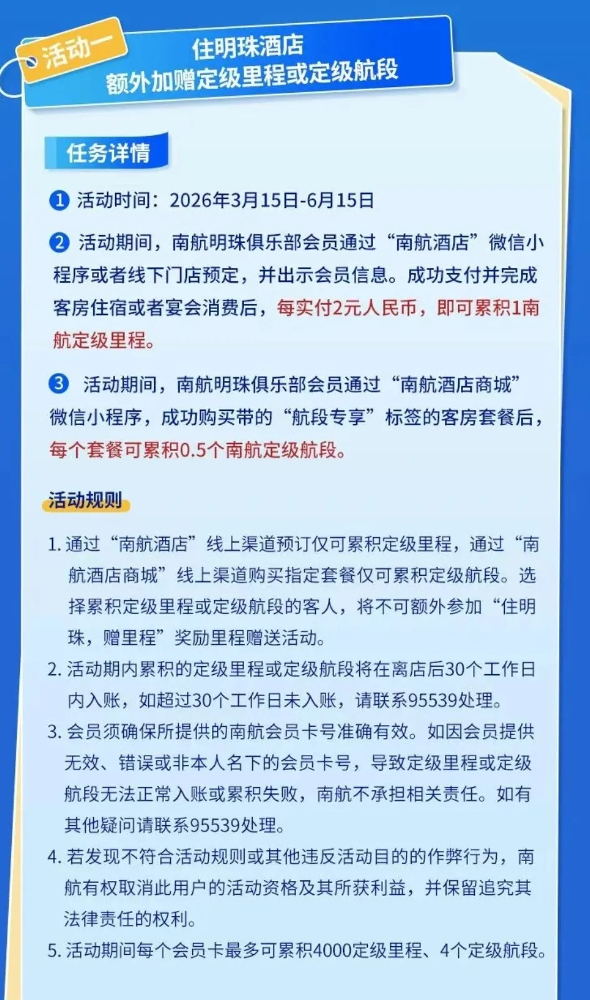
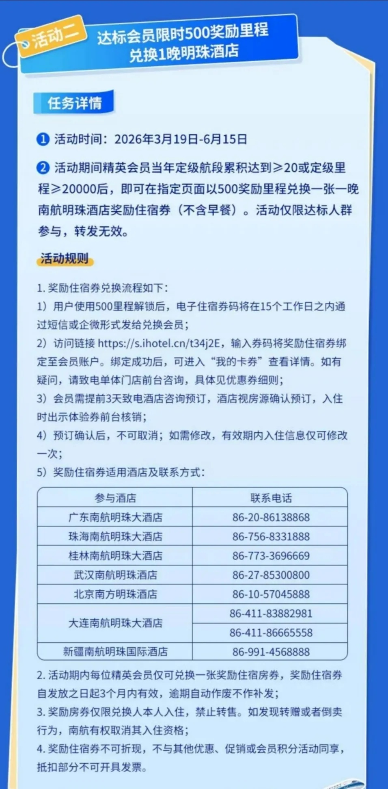
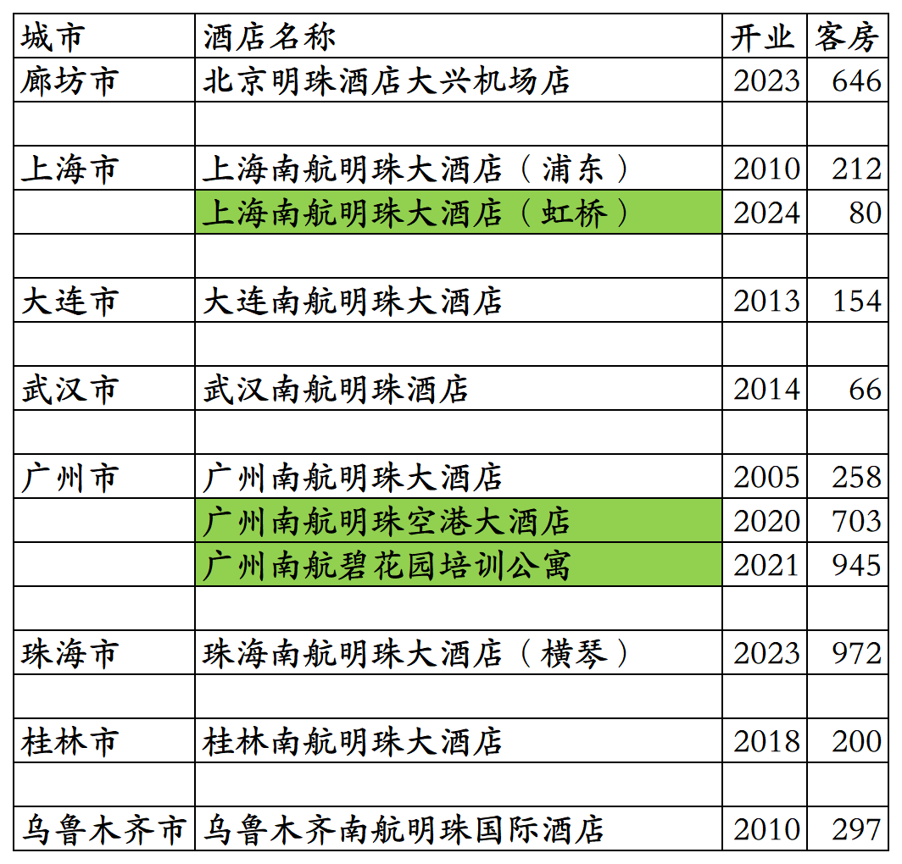
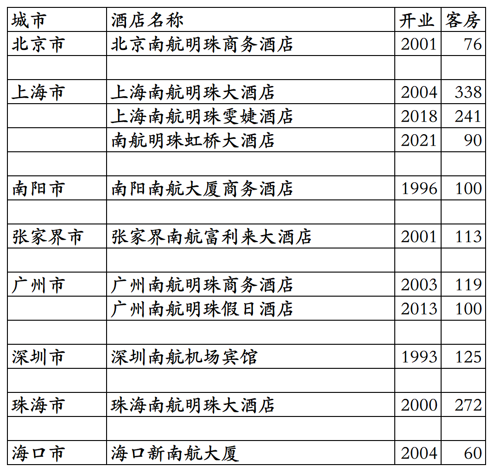

# 南航开业及退出酒店统计2025版

> 本文转载自微信公众号 **不同的角落**，已获作者授权。  
> 原文发布于 2026年4月22日 21:32  
> 原文链接：[mp.weixin.qq.com](https://mp.weixin.qq.com/s?__biz=MzU4OTczMzkwNw==&mid=2247612937&idx=1&sn=89078b5069b0f2c1d7dabb7382dc04d2&scene=21#wechat_redirect)

---

南航旗下开业及退出酒店统计，统计数据截至2025年12月31日。

目前南航旗下酒店由广东南航明珠航空服务有限公司运营管理，之前的广州南航酒店管理有限公司早已注销。

客房数据主要来自于南航酒店官方平台与OTA，部分酒店客房数量打过酒店电话核实，记录的是酒店员工告知的客房数量。

南航旗下有南航明珠国际酒店、南航明珠大酒店、南航明珠商务酒店三个品牌。

南航酒店会员计划，分为木棉清风卡、木棉和风卡、木棉金风卡、木棉扶摇卡四个等级。

目前南航在廊坊、上海、辽宁、湖北、广东、广西、新疆有酒店。

河南省郑州新郑机场区域的南航大酒店也即将开业。

截至2025年12月31日，在南航酒店官方平台有8家参与南航酒店会员计划且对外营业的南航自营酒店。

[南航明珠之一上海南航明珠大酒店浦东机场店](https://mp.weixin.qq.com/s?__biz=MzU4OTczMzkwNw==&mid=2247556103&idx=1&sn=8ed8e9c8bb6511b9896a1cc3cc19612f&scene=21#wechat_redirect)

[南航明珠之二乌鲁木齐南航明珠国际酒店](https://mp.weixin.qq.com/s?__biz=MzU4OTczMzkwNw==&mid=2247556333&idx=1&sn=d10e07e8194b5de62bb0faf3689fcb74&scene=21#wechat_redirect)

[南航明珠之三广州南航明珠大酒店白云机场店](https://mp.weixin.qq.com/s?__biz=MzU4OTczMzkwNw==&mid=2247599039&idx=1&sn=61e4dc5dc3e2a09f04f718a75be11cc8&scene=21#wechat_redirect)

2026年3月15日至6月15日，入住南航8家自营酒店，可以累积南航定级里程和定级航段。

2026年3月19日至6月15日，当年南航定级航段或定级里程达标的会员，可用500里程兑换一晚南航明珠酒店。

上海南航明珠大酒店(虹桥)为原上海南航大厦2号楼，不对外营业。

广州南航明珠空港大酒店为授权使用南航明珠品牌的加盟店，不参加南航酒店会员计划也不上线南航酒店官方平台。

广州南航碧花园培训公寓目前也不对外，主要是用作南航员工培训。

珠海南航明珠大酒店(横琴)同时也是南航珠海飞行训练公寓。

南航酒店主要是保障南航机组人员，有空房时也对外开放。

之前北京南航明珠商务酒店和上海南航明珠大酒店客房不够南航机组人员使用时，南航也会长包北京首都机场附近和上海浦东机场附近酒店客房给乘务组员工过夜。

2015年底南航集团总经理股份公司董事长司献民、集团副总经理陈港、集团运行总监田晓东、建设公司总经理胡志群、股份公司多名副总经理(刘纤、周岳海、徐杰波等)、股份公司财务部总经理卢宏业(两年半时间与女下属陶荔芳花公款36万开房410次那货，两年多时间把女下属从临时工提拔到南航股份公司财务部资产公司副经理)等多名高管贪腐窝案都被立案侦查后，估计南航为了节约成本，长包了距北京首都机场T2航站楼3公里远的如家酒店北京新国展首都机场店(现在是如家neo)和距上海南航明珠大酒店400米远的如家酒店上海浦东机场晨阳路店(现汉庭优佳上海浦东机场晨阳路店)给南航空乘员工过夜住宿。

北京这家如家散客和南航空乘员工的住宿区是分隔开的，南航空乘人员在里边住宿区；上海那家如家就是散客和南航空乘员工混住，住过两次上海那家如家都是遇到南航空姐在同一楼层，上海这家如家南航之前长包了40间房，后来又增加到80间。2018年时南航才不再续包上海这家如家酒店，酒店不久后退出如家改造翻牌为汉庭优佳。

开业：新酒店开业或是其它酒店翻牌加入时间；

客房：客房数量。

个人精力有限，部分酒店开业/退出/下线时间以及客房数量难免有错误，欢迎各位告知指正，谢谢！

南航旗下酒店。乌鲁木齐南航明珠酒店是2006年开业的南航凯宾斯基酒店翻牌。

历年退出/关停酒店。

**其它国内酒店集团开业酒店统计**：

01、锦江国内高端酒店开业及退出统计

[锦江国内高端酒店开业及退出统计2025版](https://mp.weixin.qq.com/s?__biz=MzU4OTczMzkwNw==&mid=2247609898&idx=1&sn=1bf95d3afb9ca7c4c201c8844fb7be47&scene=21#wechat_redirect)

02、华住国内高端酒店开业及退出统计

[华住国内高端酒店开业及退出统计2025版](https://mp.weixin.qq.com/s?__biz=MzU4OTczMzkwNw==&mid=2247606873&idx=1&sn=68d0d9a13b1fd7c801ba71d81d56c9fa&scene=21#wechat_redirect)

03、首旅高端品牌开业及退出酒店统计

[首旅高端品牌开业及退出酒店统计2025版](https://mp.weixin.qq.com/s?__biz=MzU4OTczMzkwNw==&mid=2247611828&idx=1&sn=72e09a8226c499e4f1bb6a9092c8fcb4&scene=21#wechat_redirect)

04、格林高端品牌开业及退出酒店统计

[格林高端品牌开业及退出酒店统计2025版](https://mp.weixin.qq.com/s?__biz=MzU4OTczMzkwNw==&mid=2247611836&idx=1&sn=964da1e90a749087b6734d2c8bbdf280&scene=21#wechat_redirect)

05、东呈高端酒店开业及退出统计

[东呈高端酒店开业及退出统计2025版](https://mp.weixin.qq.com/s?__biz=MzU4OTczMzkwNw==&mid=2247609471&idx=1&sn=3f9b86e6bb44de42272efdb69f66966f&scene=21#wechat_redirect)

06、尚美高端品牌开业及退出酒店统计

[尚美高端品牌开业及退出酒店统计2025版](https://mp.weixin.qq.com/s?__biz=MzU4OTczMzkwNw==&mid=2247611854&idx=1&sn=7a53dfe2b86a7ef9fd230ef7256cace3&scene=21#wechat_redirect)

07、开元开业及退出酒店统计

[开元开业及退出酒店统计2025版](https://mp.weixin.qq.com/s?__biz=MzU4OTczMzkwNw==&mid=2247607605&idx=1&sn=b497ea72bace78160605c89c0b16bfa9&scene=21#wechat_redirect)

08、万达开业及退出酒店统计

[万达开业及退出酒店统计2025版](https://mp.weixin.qq.com/s?__biz=MzU4OTczMzkwNw==&mid=2247607837&idx=1&sn=fa333c513bfaaa4c680f27e130ae2132&scene=21#wechat_redirect)

09、君亭开业及退出酒店统计

[君亭开业及退出酒店统计2025版](https://mp.weixin.qq.com/s?__biz=MzU4OTczMzkwNw==&mid=2247593231&idx=1&sn=e77507548dc06ec4350502f21ad6b17f&scene=21#wechat_redirect)

10、雷迪森开业及退出酒店统计

[雷迪森开业及退出酒店统计2025版](https://mp.weixin.qq.com/s?__biz=MzU4OTczMzkwNw==&mid=2247611063&idx=1&sn=4d963acb21a83c6fc1caa1050de3badd&scene=21#wechat_redirect)

11、凤悦开业及退出酒店统计

[凤悦开业及退出酒店统计2025版](https://mp.weixin.qq.com/s?__biz=MzU4OTczMzkwNw==&mid=2247610996&idx=1&sn=9771839fa64947b727044b9dd070ac86&scene=21#wechat_redirect)

12、中旅国内开业及退出酒店统计

[中旅国内开业及退出酒店统计2025版](https://mp.weixin.qq.com/s?__biz=MzU4OTczMzkwNw==&mid=2247577094&idx=1&sn=fd7d1711998de8f9bcbb32dd52ef7f3f&scene=21#wechat_redirect)

13、金陵开业及退出酒店统计

[金陵开业及退出酒店统计2025版](https://mp.weixin.qq.com/s?__biz=MzU4OTczMzkwNw==&mid=2247576523&idx=1&sn=243a19d77fcfb36bf194c97cc182834b&scene=21#wechat_redirect)

14、格兰云天开业及退出酒店统计

[格兰云天开业及退出酒店统计2025版](https://mp.weixin.qq.com/s?__biz=MzU4OTczMzkwNw==&mid=2247579183&idx=1&sn=5a1fea0a80f62d8e92af07c25e0c1c1d&scene=21#wechat_redirect)

15、安逸开业及退出酒店统计

[安逸开业及退出酒店统计2025版](https://mp.weixin.qq.com/s?__biz=MzU4OTczMzkwNw==&mid=2247612373&idx=1&sn=8034ffb15cd762e75486cc883e9a20a0&scene=21#wechat_redirect)

16、中维开业及退出酒店统计

[中维开业及退出酒店统计2025版](https://mp.weixin.qq.com/s?__biz=MzU4OTczMzkwNw==&mid=2247581530&idx=1&sn=72add848f0fb5f82831f2d46855ee507&scene=21#wechat_redirect)

17、华天开业及退出酒店统计

[华天开业及退出酒店统计2025版](https://mp.weixin.qq.com/s?__biz=MzU4OTczMzkwNw==&mid=2247583997&idx=1&sn=46d5ab82f71c6249eb3f811ec108a794&scene=21#wechat_redirect)

18、凯莱开业及退出酒店统计

[凯莱开业及退出酒店统计2025版](https://mp.weixin.qq.com/s?__biz=MzU4OTczMzkwNw==&mid=2247611049&idx=1&sn=bf910cbfed36554af7ec82ad3196cf20&scene=21#wechat_redirect)

19、绿地开业及退出酒店统计

[绿地开业及退出酒店统计2025版](https://mp.weixin.qq.com/s?__biz=MzU4OTczMzkwNw==&mid=2247611758&idx=1&sn=04c4aacebb06c3a01883f452c18aad52&scene=21#wechat_redirect)

20、岭南开业及退出酒店统计

[岭南开业及退出酒店统计2025版](https://mp.weixin.qq.com/s?__biz=MzU4OTczMzkwNw==&mid=2247611863&idx=1&sn=94c8e4cac10b069a7d275fdf26e0a85b&scene=21#wechat_redirect)

21、黄龙开业及退出酒店统计

[黄龙开业酒店统计2025版](https://mp.weixin.qq.com/s?__biz=MzU4OTczMzkwNw==&mid=2247612326&idx=1&sn=915c3b50d8f0d1b11514751cf5a40904&scene=21#wechat_redirect)

22、厦门建发开业及退出酒店统计

[厦门建发开业及退出酒店统计2025版](https://mp.weixin.qq.com/s?__biz=MzU4OTczMzkwNw==&mid=2247610581&idx=1&sn=397cee1f3684486c32ebeb215249ffce&scene=21#wechat_redirect)

23、厦门佰翔开业及退出酒店统计

[厦门佰翔开业及退出酒店统计2025版](https://mp.weixin.qq.com/s?__biz=MzU4OTczMzkwNw==&mid=2247579739&idx=1&sn=89912fcad6eab52a875ba40260bdef98&scene=21#wechat_redirect)

24、福建旅发开业及退出酒店统计

[福建旅发开业及退出酒店统计2025版](https://mp.weixin.qq.com/s?__biz=MzU4OTczMzkwNw==&mid=2247576672&idx=1&sn=bcbdf134ca973ca406d8e5d572069de3&scene=21#wechat_redirect)

25、远洲旅业开业及退出酒店统计

[远洲旅业开业及退出酒店统计2025版](https://mp.weixin.qq.com/s?__biz=MzU4OTczMzkwNw==&mid=2247576868&idx=1&sn=a5fc7218eb9630362828b884a61f4d6d&scene=21#wechat_redirect)

26、乔治莫兰迪开业酒店统计

[乔治莫兰迪开业酒店统计2025版](https://mp.weixin.qq.com/s?__biz=MzU4OTczMzkwNw==&mid=2247590594&idx=1&sn=ccb2ef8da02e866e2706c5dffced1fbd&scene=21#wechat_redirect)

更多的国内酒店统计、年度酒店排行、酒店常识、酒店行业资讯、酒店集团、航空常识、沈阳旅游、沙发客、打油诗等相关内容可以到我的微信公众号里查看。

也欢迎大家关注我的微信公众号和视频号，名称都是：**不同的角落**

微信直接搜索不同的角落就可以搜索到。

也可以直接点开下方公众号名片关注。