# 酒店杂谈：一帮业余选手，打着专业旗号，编造号称权威发布的的虚假报告，中国饭店协会《2026中国酒店集团及品牌发展报告》中榜单纠错篇一

> **作者**：不同的角落  
> **发布时间**：2026年4月26日 23:27  
> **原文链接**：[酒店杂谈：一帮业余选手，打着专业旗号，编造号称权威发布的的虚假报告，中国饭店协会《2026中国酒店集团及品牌发展报告》中榜单纠错篇一](http://mp.weixin.qq.com/s?__biz=MzU4OTczMzkwNw==&mid=2247612995&idx=1&sn=379a444d7e5f279170f115e1c154b852&chksm=fdca733fcabdfa298a174aa8948ef257047bf9a136f706a5154d9cf62bd849de8594b1fae943)

---

2026年4月21日至22日，由中国饭店协会主办的“第十五届中国饭店文化节”在广东省珠海市举行。

2026年4月22日，中国饭店协会发布《2026中国酒店集团及品牌发展报告》，报告由中国饭店协会联合携程集团、上海盈蝶企业管理咨询有限公司、香港理工大学酒店及旅游业管理学院共同编写。

报告里有发布

2025年度中国前50家酒集团规模排行榜

和

2025年度中国前20家豪华品牌酒店规模排行榜、

2025年度中国前10家高端全服务酒店品牌规模排行榜、

2025年度中国前10家高端精选服务酒店品牌规模排行榜、

2025年度中国前30家中端品牌酒店规模排行榜、

2025年度中国前30家经济型品牌酒店规模排行榜、

2025年度中国境内前30家外资品牌酒店规模排行榜。

其中2025年度中国前50家酒店集团规模排行榜，是以截至2025年12月31日，国内各酒店集团旗下中国境内已开业酒店客房总数量多少排名，不含筹建数和签约数。

其余榜单，也都是以截至2025年12月31日，国内各酒店集团旗下品牌和进驻国内的外资酒店集团旗下品牌，在中国境内已开业酒店客房总数量多少排名，不含筹建数和签约数。

同往年一样，2025年度国内酒店集团50强榜单依旧是搞笑的假榜单，同往年一样还是半数以上都是假数据。

其余榜单，假数据也不少，还有一些专业性错误。

一帮砖业选手，结果比我这个业余选手还业余，每年都是错误百出的报告，还年年说是权威发布。

发展报告是要以数据说话的，数据很多都是假的，在假数据基础上做出的分析报告又有多少可信度？还有专业性错误，也好意思年年宣称权威发布？

榜单中的一些靠虚假数据上榜的酒店集团，在自家官方平台大肆宣传自家虚报的酒店规模和其余榜单排名。真是一点脸都不要了，自家开业多少酒店心里没点13数么？

2025年度中国前50家酒店集团规模排行榜和其余部分排行榜如下：

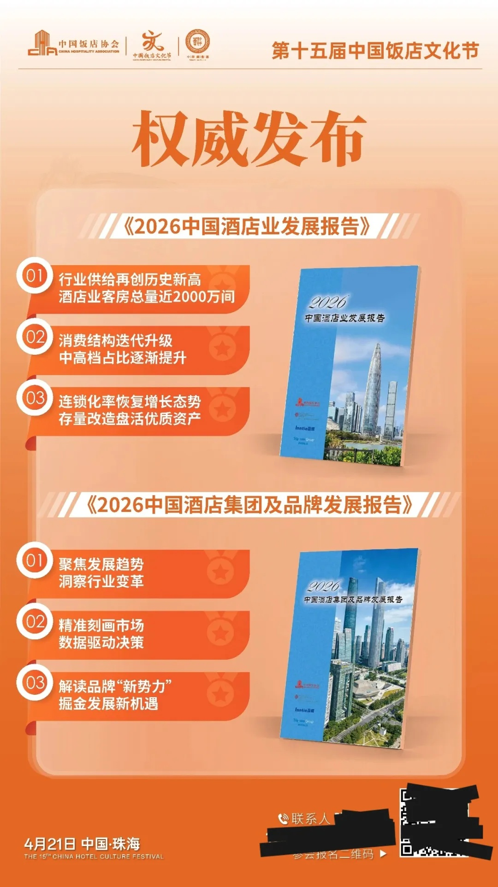

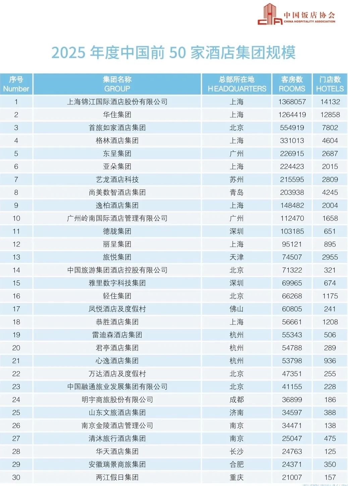

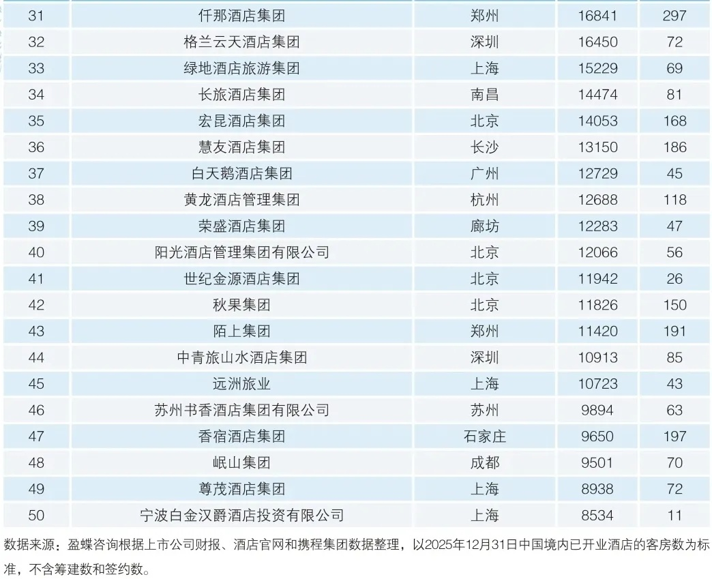

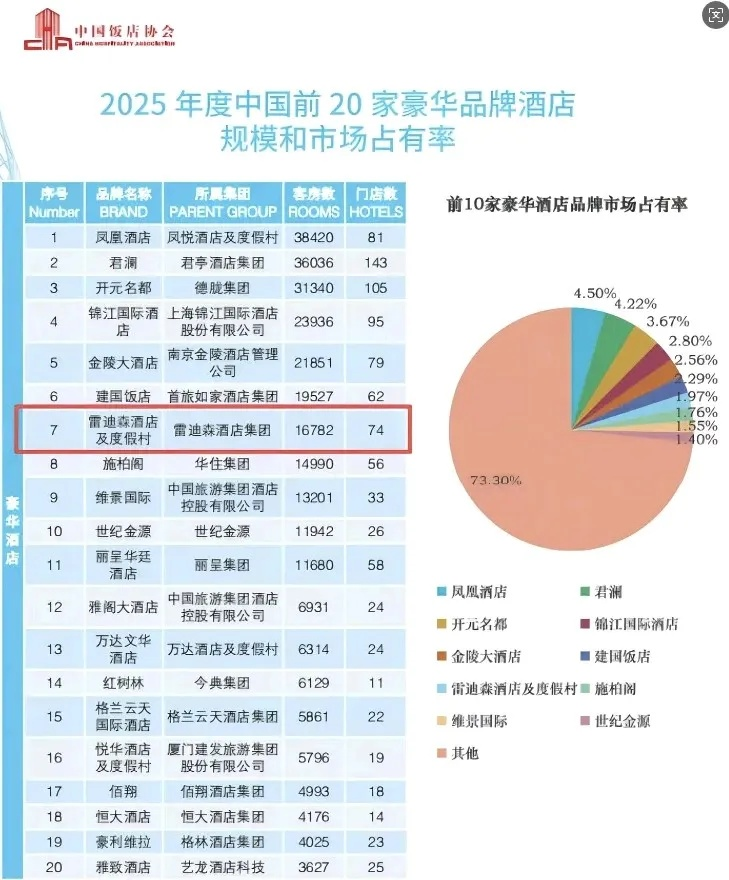

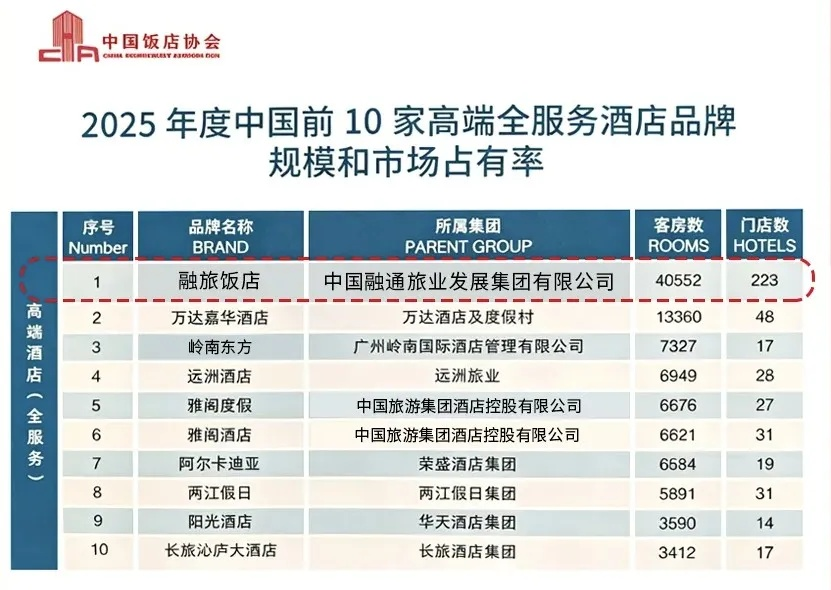

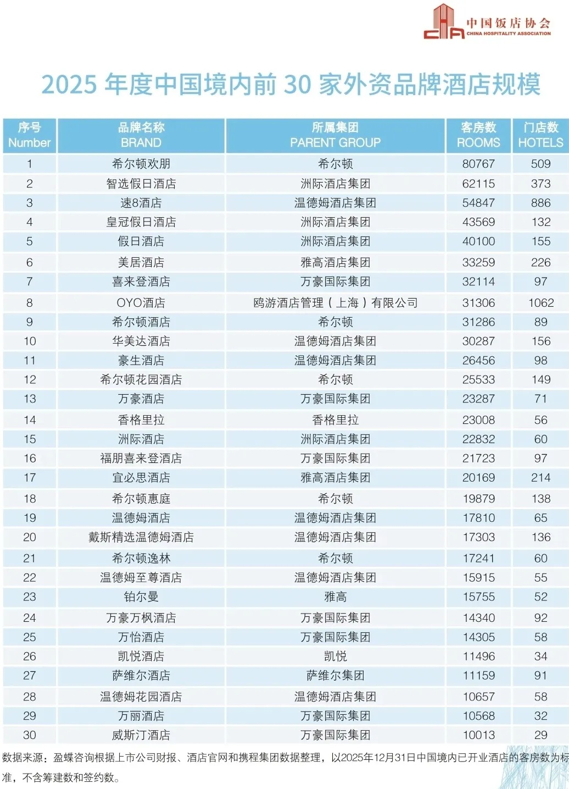

2025年度中国前50家酒店集团规模排行榜的纠错，等我再发几篇榜单中酒店集团开业酒店统计后再发布。

今天先写一下

2025年度中国前20家豪华品牌酒店规模排行榜榜单中的错误。

报告中将国内酒店品牌档次从高到低排序分为

豪华

高端全服务/高端精选

中端

经济型

四档，

最高的一档豪华酒店，怎么也得是五星级档次才说得过去吧。

而榜单中的锦江国际酒店(实际上是锦江)、金陵大酒店(实际上是金陵)、建国、丽呈华廷、雅致这5个品牌开业酒店，并不是所有酒店都是五星级档次酒店，很多只是四星级档次全服务酒店，锦江、金陵品牌酒店还有几家只是三星级档次全服务酒店。

一只由多块长短不一木板组成的木桶，其能装下的水量并不取决于最长的那块木板，而是由最短的那块木板决定。

一个酒店品牌应该划分到哪一档，也不能只看这个品牌旗下的最高标准酒店是哪一档，就把品牌划分到哪一档。

比如福朋喜来登、假日、华美达、豪生、戴斯等品牌国内酒店，都有一家到多家酒店是挂牌五星级酒店，但是福朋喜来登、假日、华美达、豪生、戴斯这5个品牌仍然不是五星级档次酒店品牌。

再来看看假数据，20个品牌榜单中酒店数量与实际酒店数量对比如下：

2025年度中国前20家豪华品牌酒店

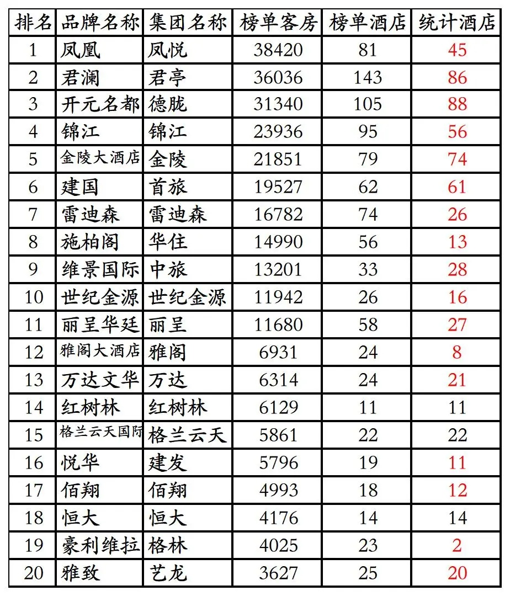

1、凤悦旗下凤凰酒店只有45家。

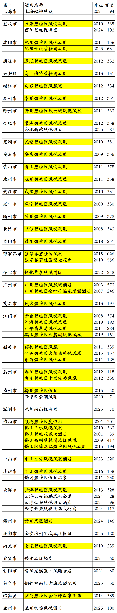

更多凤悦开业酒店可以看：

[凤悦开业及退出酒店统计2025版](https://mp.weixin.qq.com/s?__biz=MzU4OTczMzkwNw==&mid=2247610996&idx=1&sn=9771839fa64947b727044b9dd070ac86&scene=21#wechat_redirect)

2、君亭旗下君澜品牌酒店只有86家。

更多君亭开业酒店可以看：

[君亭开业及退出酒店统计2025版](https://mp.weixin.qq.com/s?__biz=MzU4OTczMzkwNw==&mid=2247593231&idx=1&sn=e77507548dc06ec4350502f21ad6b17f&scene=21#wechat_redirect)

3、德胧旗下开元名都品牌酒店只有88家。且北京宁波宾馆2025年底时还是停业装修升级状态，2026年装修升级完成后达到五星级档次才划到开元名都品牌里。北京宁波宾馆是一家挂牌二星级全服务酒店，星级标牌号是1120021。

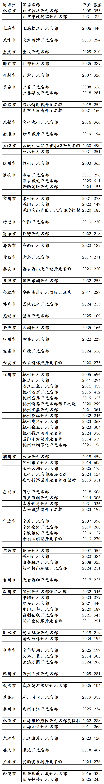

更多开元开业酒店可以看：

[开元开业及退出酒店统计2025版](https://mp.weixin.qq.com/s?__biz=MzU4OTczMzkwNw==&mid=2247607605&idx=1&sn=b497ea72bace78160605c89c0b16bfa9&scene=21#wechat_redirect)

4、锦江旗下锦江品牌酒店只有56家。统计表中除锦江外还有1家J酒店、2家昆仑品牌酒店。

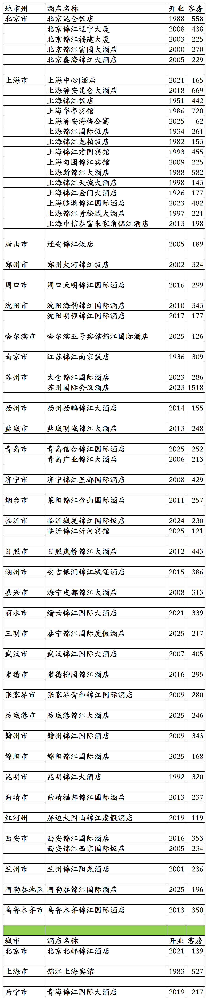

更多锦江开业酒店可以看：

[锦江国内高端酒店开业及退出统计2025版](https://mp.weixin.qq.com/s?__biz=MzU4OTczMzkwNw==&mid=2247609898&idx=1&sn=1bf95d3afb9ca7c4c201c8844fb7be47&scene=21#wechat_redirect)

5、金陵官方平台“尊享金陵”小程序，选择城市，选择“金陵大酒店”品牌，一家酒店都没有。选择“金陵饭店、金陵大酒店、金陵酒店”三项都选上，才有酒店。

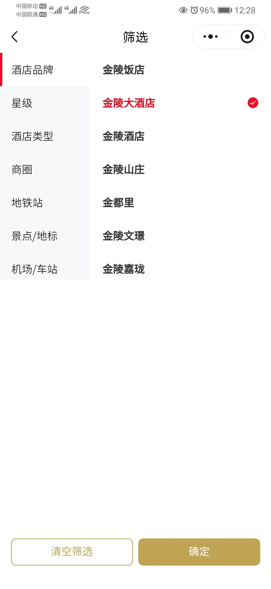

金陵品牌酒店只有74家。深圳江苏宾馆是三星级档次酒店，之前是挂牌二星级全服务酒店，未通过星评复核被摘星。

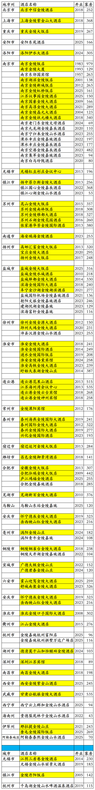

更多金陵开业酒店可以看：

[金陵开业及退出酒店统计2025版](https://mp.weixin.qq.com/s?__biz=MzU4OTczMzkwNw==&mid=2247576523&idx=1&sn=243a19d77fcfb36bf194c97cc182834b&scene=21#wechat_redirect)

6、首旅旗下建国品牌酒店有62家，包括白俄罗斯1家，国内实际数量61家。

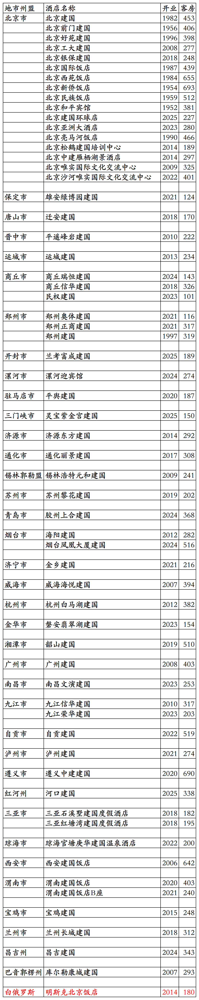

更多首旅开业酒店可以看：

[首旅高端品牌开业及退出酒店统计2025版](https://mp.weixin.qq.com/s?__biz=MzU4OTczMzkwNw==&mid=2247611828&idx=1&sn=72e09a8226c499e4f1bb6a9092c8fcb4&scene=21#wechat_redirect)

7、雷迪森旗下雷迪森品牌国内酒店只有26家。

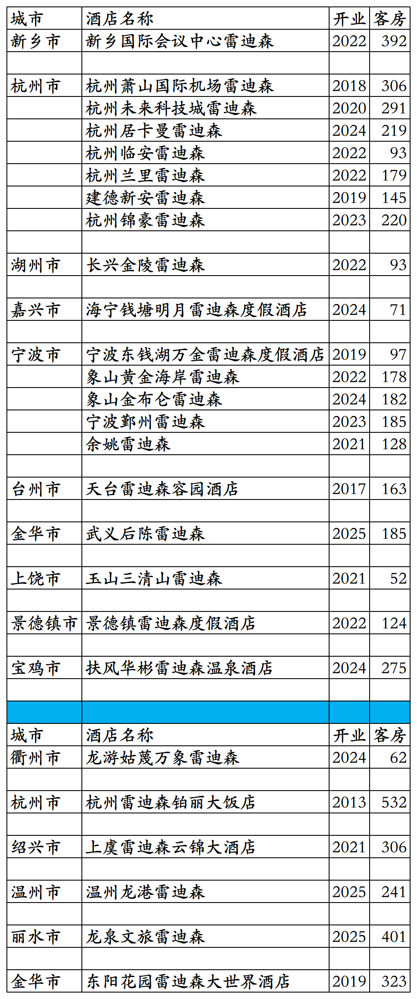

更多雷迪森开业酒店可以看：

[雷迪森开业及退出酒店统计2025版](https://mp.weixin.qq.com/s?__biz=MzU4OTczMzkwNw==&mid=2247611063&idx=1&sn=4d963acb21a83c6fc1caa1050de3badd&scene=21#wechat_redirect)

8、华住旗下施柏阁品牌酒店国内只有13家，56家是全球数量。

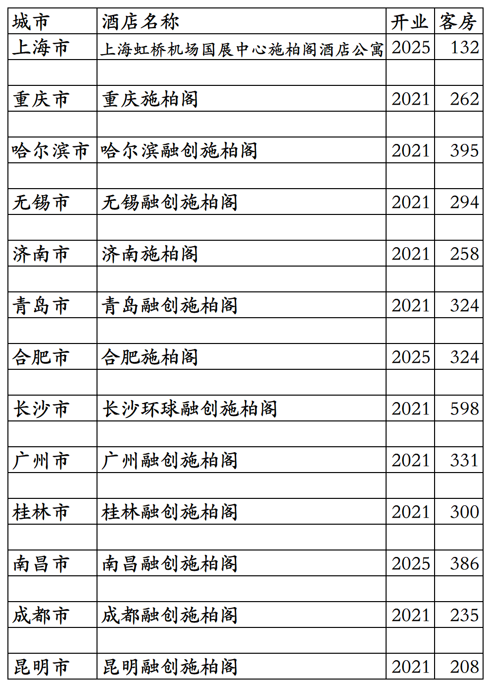

更多华住开业酒店可以看：

[华住国内高端酒店开业及退出统计2025版](https://mp.weixin.qq.com/s?__biz=MzU4OTczMzkwNw==&mid=2247606873&idx=1&sn=68d0d9a13b1fd7c801ba71d81d56c9fa&scene=21#wechat_redirect)

9、中旅旗下维景国际品牌酒店只有28家。

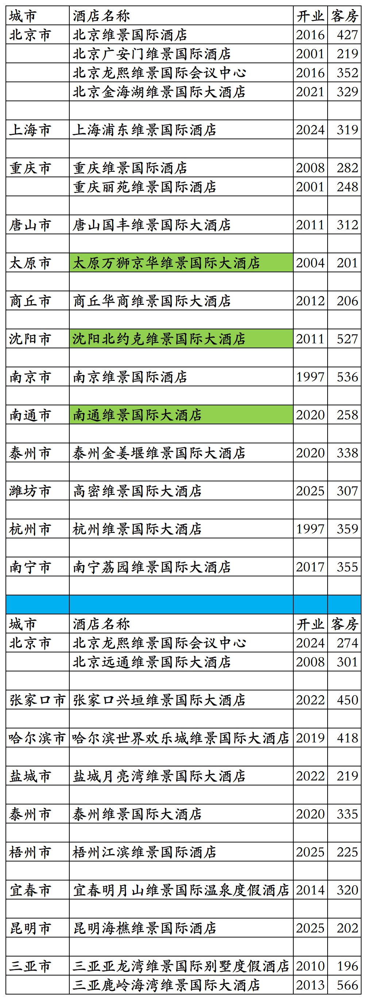

更多中旅开业酒店可以看：

[中旅国内开业及退出酒店统计2025版](https://mp.weixin.qq.com/s?__biz=MzU4OTczMzkwNw==&mid=2247577094&idx=1&sn=fd7d1711998de8f9bcbb32dd52ef7f3f&scene=21#wechat_redirect)

10、世纪金源旗下世纪金源品牌酒店只有16家。

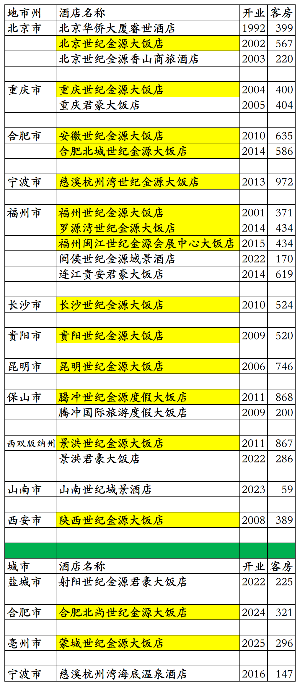

更多世纪金源开业酒店可以看：

[世纪金源开业及退出酒店统计2025版](https://mp.weixin.qq.com/s?__biz=MzU4OTczMzkwNw==&mid=2247612965&idx=1&sn=588cfe403fbcce3486fe3dab3b733096&scene=21#wechat_redirect)

11、丽呈旗下丽呈华廷品牌酒店只有27家，之前退出的丽呈华廷酒店有15家，丽呈会小程序把几家丽斯珀、丽呈花盛、丽呈花园和1家明宇丽呈酒店划分到丽呈华廷品牌里，但那几家酒店只能说是和丽呈华廷同档次酒店，但并不是丽呈华廷酒店，并且就算加上那几家其它品牌酒店，也才30多家。

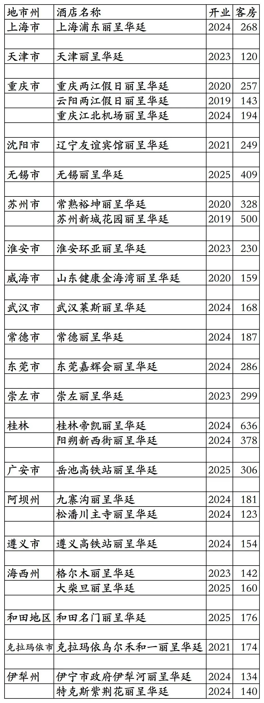

12、中旅战略投资的雅阁旗下雅阁大酒店品牌国内只有8家酒店。

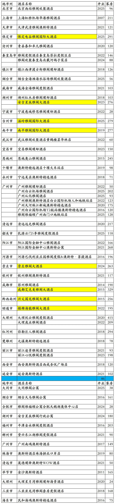

更多雅阁国内开业酒店可以看：

[雅阁国内开业及退出酒店统计2025版](https://mp.weixin.qq.com/s?__biz=MzU4OTczMzkwNw==&mid=2247606646&idx=1&sn=06f16fecc46574c51e4e3d2e82d28cd4&scene=21#wechat_redirect)

13、万达旗下万达文华品牌酒店国内只有21家，国外还有3家。

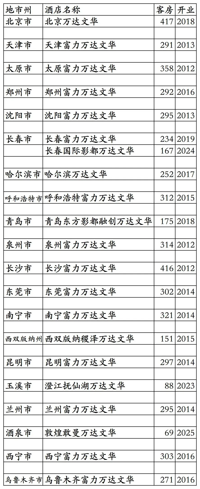

更多万达开业酒店可以看：

[万达开业及退出酒店统计2025版](https://mp.weixin.qq.com/s?__biz=MzU4OTczMzkwNw==&mid=2247607837&idx=1&sn=fa333c513bfaaa4c680f27e130ae2132&scene=21#wechat_redirect)

14、今典集团旗下红树林旗下红树林品牌酒店11家。

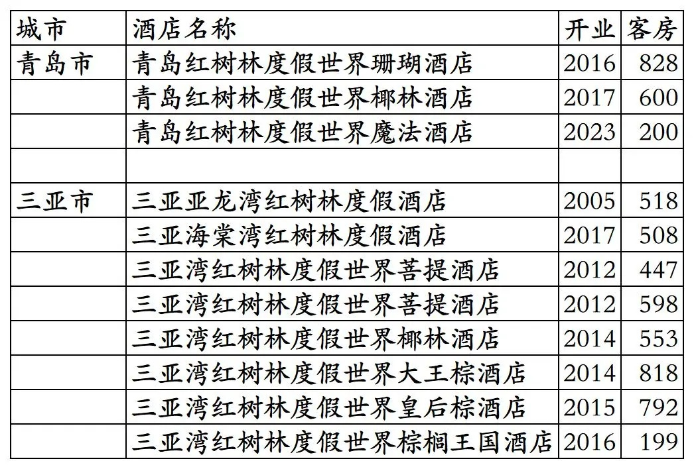

15、格兰云天旗下格兰云天国际品牌酒店只有45家。

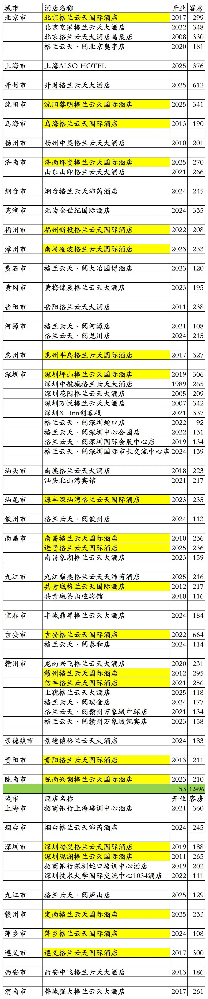

更多格兰云天开业酒店可以看：

[格兰云天开业及退出酒店统计2025版](https://mp.weixin.qq.com/s?__biz=MzU4OTczMzkwNw==&mid=2247579183&idx=1&sn=5a1fea0a80f62d8e92af07c25e0c1c1d&scene=21#wechat_redirect)

16、厦门建发旗下悦华品牌酒店只有11家。

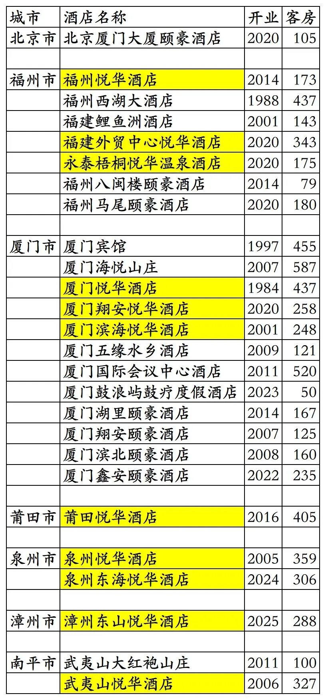

更多建发开业酒店可以看：

[厦门建发开业及退出酒店统计2025版](https://mp.weixin.qq.com/s?__biz=MzU4OTczMzkwNw==&mid=2247610581&idx=1&sn=397cee1f3684486c32ebeb215249ffce&scene=21#wechat_redirect)

17、佰翔旗下佰翔品牌酒店只有12家。

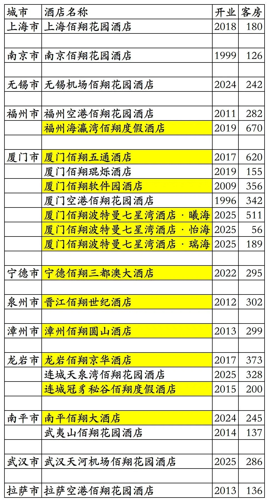

更多佰翔开业酒店可以看：

[厦门佰翔开业及退出酒店统计2025版](https://mp.weixin.qq.com/s?__biz=MzU4OTczMzkwNw==&mid=2247579739&idx=1&sn=89912fcad6eab52a875ba40260bdef98&scene=21#wechat_redirect)

18、恒大旗下恒大品牌酒店14家。

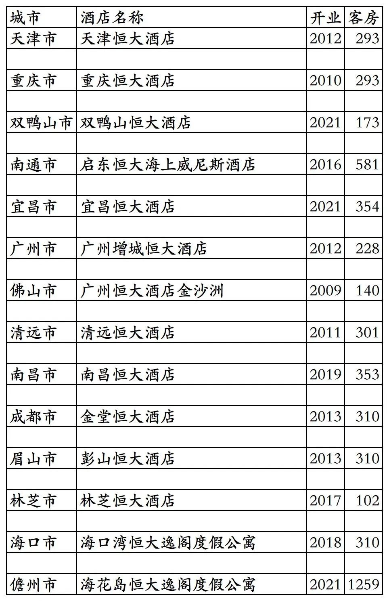

19、格林合作的马来西亚豪利维拉酒店集团旗下豪利维拉品牌酒店，格林开发运营属于格林旗下的只有2家，国内还有1家炎陵神农谷豪利维拉酒店是之前豪利维拉开发运营的，并未与格林合作，国内之前豪利维拉开发运营的豪利维拉品牌酒店都已退出翻牌或停业。

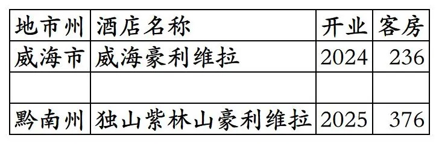

更多格林开业酒店可以看：

[格林高端品牌开业及退出酒店统计2025版](https://mp.weixin.qq.com/s?__biz=MzU4OTczMzkwNw==&mid=2247611836&idx=1&sn=964da1e90a749087b6734d2c8bbdf280&scene=21#wechat_redirect)

[豪利维拉之一威海豪利维拉](https://mp.weixin.qq.com/s?__biz=MzU4OTczMzkwNw==&mid=2247548928&idx=1&sn=ffab85ddab27dc685eacf582abf12b38&scene=21#wechat_redirect)

[豪利维拉之二天下第一水司楼改建的紫林山豪利维拉酒店](https://mp.weixin.qq.com/s?__biz=MzU4OTczMzkwNw==&mid=2247555243&idx=1&sn=b90afb226a4fa483a71006e3409caf13&scene=21#wechat_redirect)

20、艺龙旗下雅致品牌酒店只有20家，上海还有1家2020年翻牌的雅致，在美豪被同程收购后并未加入艺龙，并不是艺龙旗下。

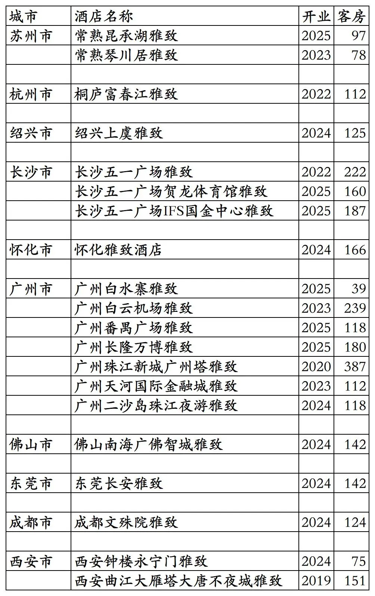

更多的酒店行业资讯、酒店常识、酒店集团、酒店入住体验、航空常识、机场交通、行政区划、沈阳旅游、沙发客、打油诗等相关内容可以到我的微信公众号里查看。

也欢迎大家关注我的微信公众号和视频号，名称都是：**不****同的角落**

在微信搜索不同的角落就可以搜索到，也可以直接点下方公众号名片关注。