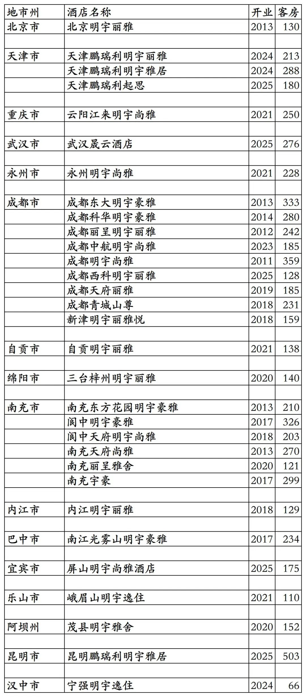
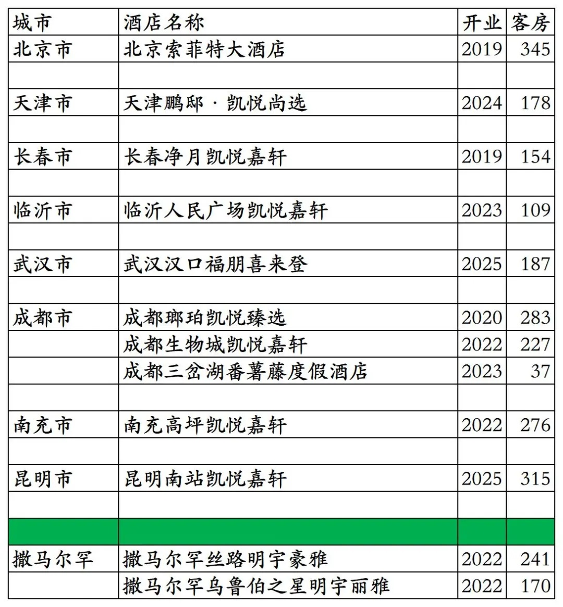
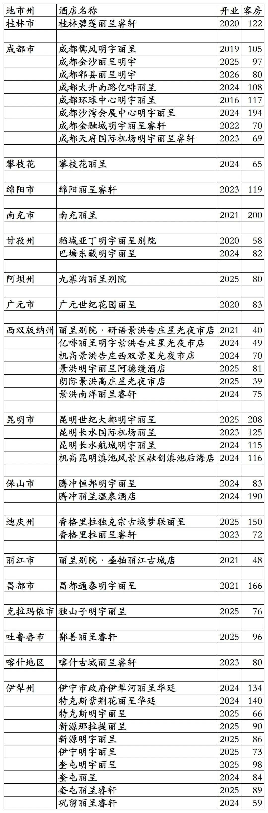
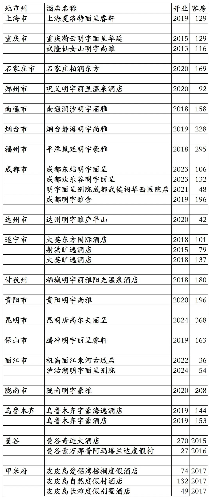

# 明宇开业及退出酒店统计2025版

> **作者**：不同的角落  
> **发布时间**：2026年5月5日 20:38  
> **原文链接**：[明宇开业及退出酒店统计2025版](https://mp.weixin.qq.com/s?__biz=MzU4OTczMzkwNw==&mid=2247613173&idx=1&sn=342cc37368b166f7e485eadfe0f5069a&scene=21)

---

明宇酒店集团旗下开业及退出酒店统计，统计数据截至2025年12月31日。包括明宇与丽呈合作的明宇丽呈(明宇持股60%)旗下酒店，不含明宇持股52%的绿城酒管旗下酒店。

客房数据主要来自于明宇酒店官方平台、丽呈会官方平台与OTA，部分酒店客房数量打过酒店电话核实，记录的是酒店员工告知的客房数量。

明宇旗下有明宇豪雅、明宇丽雅、明宇尚雅、明宇雅居、明宇逸住等酒店品牌。还特许经营凯悦旗下的凯悦臻选、凯悦尚选、凯悦嘉轩品牌；管理1家雅高旗下索菲特、1家万豪旗下福朋喜来登、1家台湾番薯藤旗下番薯藤品牌酒店。另外明宇与丽呈合作成立的明宇丽呈旗下有明宇丽呈、杋高等酒店品牌。

明宇会会员计划，分为银卡、金卡、钻石卡三个等级。

明宇丽呈旗下酒店参加丽呈会会员计划。

截至2025年12月31日，在明宇官方平台有明宇自有品牌酒店国内31家，国外乌兹别克斯坦2家，明宇特许经营/管理合作的国际品牌酒店10家。在丽呈会平台有明宇丽呈旗下酒店45家。

中国旅游饭店业协会经过严格缜密的数据统计、分析与核实，发布的2021-2024年度中国饭店集团60强榜单中，统计的明宇开业酒店与客房数量如下：

2021年181家酒店35095间客房，

2022年193家酒店38536间客房，

2023年194家酒店38557间客房，

2024年190家酒店36403间客房。

目前明宇在北京、天津、重庆、吉林、山东、湖北、湖南、广西、四川、云南、西藏、陕西、新疆有酒店。国外乌兹别克斯坦有酒店。

开业：新酒店开业或是其它酒店翻牌加入时间；

客房：客房数量。

个人精力有限，部分酒店开业/退出/下线时间以及客房数量难免有错误，欢迎各位告知指正，谢谢！

明宇官方平台国内31家自有品牌酒店。有几家酒店所有日期都不能预订，但可以在OTA平台预订。

明宇官方平台2家自有品牌国外酒店和10家国际品牌酒店。10家国际品牌酒店都参加明宇会会员计划。

丽呈会平台45家明宇丽呈旗下酒店。

历年退出/关停酒店。包括5家泰国酒店。

**其它国内酒店集团开业酒店统计**：

01、锦江国内高端酒店开业及退出统计

[锦江国内高端酒店开业及退出统计2025版](https://mp.weixin.qq.com/s?__biz=MzU4OTczMzkwNw==&mid=2247609898&idx=1&sn=1bf95d3afb9ca7c4c201c8844fb7be47&scene=21#wechat_redirect)

02、华住国内高端酒店开业及退出统计

[华住国内高端酒店开业及退出统计2025版](https://mp.weixin.qq.com/s?__biz=MzU4OTczMzkwNw==&mid=2247606873&idx=1&sn=68d0d9a13b1fd7c801ba71d81d56c9fa&scene=21#wechat_redirect)

03、首旅高端品牌开业及退出酒店统计

[首旅高端品牌开业及退出酒店统计2025版](https://mp.weixin.qq.com/s?__biz=MzU4OTczMzkwNw==&mid=2247611828&idx=1&sn=72e09a8226c499e4f1bb6a9092c8fcb4&scene=21#wechat_redirect)

04、格林高端品牌开业及退出酒店统计

[格林高端品牌开业及退出酒店统计2025版](https://mp.weixin.qq.com/s?__biz=MzU4OTczMzkwNw==&mid=2247611836&idx=1&sn=964da1e90a749087b6734d2c8bbdf280&scene=21#wechat_redirect)

05、东呈高端品牌开业及退出酒店统计

[东呈高端品牌开业及退出酒店统计2025版](https://mp.weixin.qq.com/s?__biz=MzU4OTczMzkwNw==&mid=2247609471&idx=1&sn=3f9b86e6bb44de42272efdb69f66966f&scene=21#wechat_redirect)

06、尚美高端品牌开业及退出酒店统计

[尚美高端品牌开业及退出酒店统计2025版](https://mp.weixin.qq.com/s?__biz=MzU4OTczMzkwNw==&mid=2247611854&idx=1&sn=7a53dfe2b86a7ef9fd230ef7256cace3&scene=21#wechat_redirect)

07、开元开业及退出酒店统计

[开元开业及退出酒店统计2025版](https://mp.weixin.qq.com/s?__biz=MzU4OTczMzkwNw==&mid=2247607605&idx=1&sn=b497ea72bace78160605c89c0b16bfa9&scene=21#wechat_redirect)

08、万达开业及退出酒店统计

[万达开业及退出酒店统计2025版](https://mp.weixin.qq.com/s?__biz=MzU4OTczMzkwNw==&mid=2247607837&idx=1&sn=fa333c513bfaaa4c680f27e130ae2132&scene=21#wechat_redirect)

09、君亭开业及退出酒店统计

[君亭开业及退出酒店统计2025版](https://mp.weixin.qq.com/s?__biz=MzU4OTczMzkwNw==&mid=2247593231&idx=1&sn=e77507548dc06ec4350502f21ad6b17f&scene=21#wechat_redirect)

10、雷迪森开业及退出酒店统计

[雷迪森开业及退出酒店统计2025版](https://mp.weixin.qq.com/s?__biz=MzU4OTczMzkwNw==&mid=2247611063&idx=1&sn=4d963acb21a83c6fc1caa1050de3badd&scene=21#wechat_redirect)

11、凤悦开业及退出酒店统计

[凤悦开业及退出酒店统计2025版](https://mp.weixin.qq.com/s?__biz=MzU4OTczMzkwNw==&mid=2247610996&idx=1&sn=9771839fa64947b727044b9dd070ac86&scene=21#wechat_redirect)

12、中旅国内开业及退出酒店统计

[中旅国内开业及退出酒店统计2025版](https://mp.weixin.qq.com/s?__biz=MzU4OTczMzkwNw==&mid=2247577094&idx=1&sn=fd7d1711998de8f9bcbb32dd52ef7f3f&scene=21#wechat_redirect)

13、金陵开业及退出酒店统计

[金陵开业及退出酒店统计2025版](https://mp.weixin.qq.com/s?__biz=MzU4OTczMzkwNw==&mid=2247576523&idx=1&sn=243a19d77fcfb36bf194c97cc182834b&scene=21#wechat_redirect)

14、格兰云天开业及退出酒店统计

[格兰云天开业及退出酒店统计2025版](https://mp.weixin.qq.com/s?__biz=MzU4OTczMzkwNw==&mid=2247579183&idx=1&sn=5a1fea0a80f62d8e92af07c25e0c1c1d&scene=21#wechat_redirect)

15、安逸开业及退出酒店统计

[安逸开业及退出酒店统计2025版](https://mp.weixin.qq.com/s?__biz=MzU4OTczMzkwNw==&mid=2247612373&idx=1&sn=8034ffb15cd762e75486cc883e9a20a0&scene=21#wechat_redirect)

16、中维开业及退出酒店统计

[中维开业及退出酒店统计2025版](https://mp.weixin.qq.com/s?__biz=MzU4OTczMzkwNw==&mid=2247581530&idx=1&sn=72add848f0fb5f82831f2d46855ee507&scene=21#wechat_redirect)

17、华天开业及退出酒店统计

[华天开业及退出酒店统计2025版](https://mp.weixin.qq.com/s?__biz=MzU4OTczMzkwNw==&mid=2247583997&idx=1&sn=46d5ab82f71c6249eb3f811ec108a794&scene=21#wechat_redirect)

18、凯莱开业及退出酒店统计

[凯莱开业及退出酒店统计2025版](https://mp.weixin.qq.com/s?__biz=MzU4OTczMzkwNw==&mid=2247611049&idx=1&sn=bf910cbfed36554af7ec82ad3196cf20&scene=21#wechat_redirect)

19、绿地开业及退出酒店统计

[绿地开业及退出酒店统计2025版](https://mp.weixin.qq.com/s?__biz=MzU4OTczMzkwNw==&mid=2247611758&idx=1&sn=04c4aacebb06c3a01883f452c18aad52&scene=21#wechat_redirect)

20、岭南开业及退出酒店统计

[岭南开业及退出酒店统计2025版](https://mp.weixin.qq.com/s?__biz=MzU4OTczMzkwNw==&mid=2247611863&idx=1&sn=94c8e4cac10b069a7d275fdf26e0a85b&scene=21#wechat_redirect)

21、黄龙开业及退出酒店统计

[黄龙开业酒店统计2025版](https://mp.weixin.qq.com/s?__biz=MzU4OTczMzkwNw==&mid=2247612326&idx=1&sn=915c3b50d8f0d1b11514751cf5a40904&scene=21#wechat_redirect)

22、厦门建发开业及退出酒店统计

[厦门建发开业及退出酒店统计2025版](https://mp.weixin.qq.com/s?__biz=MzU4OTczMzkwNw==&mid=2247610581&idx=1&sn=397cee1f3684486c32ebeb215249ffce&scene=21#wechat_redirect)

23、厦门佰翔开业及退出酒店统计

[厦门佰翔开业及退出酒店统计2025版](https://mp.weixin.qq.com/s?__biz=MzU4OTczMzkwNw==&mid=2247579739&idx=1&sn=89912fcad6eab52a875ba40260bdef98&scene=21#wechat_redirect)

24、福建旅发开业及退出酒店统计

[福建旅发开业及退出酒店统计2025版](https://mp.weixin.qq.com/s?__biz=MzU4OTczMzkwNw==&mid=2247576672&idx=1&sn=bcbdf134ca973ca406d8e5d572069de3&scene=21#wechat_redirect)

25、远洲旅业开业及退出酒店统计

[远洲旅业开业及退出酒店统计2025版](https://mp.weixin.qq.com/s?__biz=MzU4OTczMzkwNw==&mid=2247576868&idx=1&sn=a5fc7218eb9630362828b884a61f4d6d&scene=21#wechat_redirect)

26、南航开业及退出酒店统计

[南航开业及退出酒店统计2025版](https://mp.weixin.qq.com/s?__biz=MzU4OTczMzkwNw==&mid=2247612937&idx=1&sn=89078b5069b0f2c1d7dabb7382dc04d2&scene=21#wechat_redirect)

27、白金汉爵开业及退出酒店统计

[白金汉爵开业酒店统计2025版](https://mp.weixin.qq.com/s?__biz=MzU4OTczMzkwNw==&mid=2247612945&idx=1&sn=390bf7b7163e27f21f40baf07ff5b0f5&scene=21#wechat_redirect)

29、世纪金源开业及退出酒店统计

[世纪金源开业及退出酒店统计2025版](https://mp.weixin.qq.com/s?__biz=MzU4OTczMzkwNw==&mid=2247612965&idx=1&sn=588cfe403fbcce3486fe3dab3b733096&scene=21#wechat_redirect)

30、尊茂开业及退出酒店统计

[尊茂开业及退出酒店统计2025版](https://mp.weixin.qq.com/s?__biz=MzU4OTczMzkwNw==&mid=2247613007&idx=1&sn=abbf6f8d16b210ef40f1ebb800b8a997&scene=21#wechat_redirect)

31、岷山开业及退出酒店统计

[岷山开业及退出酒店统计2025版](https://mp.weixin.qq.com/s?__biz=MzU4OTczMzkwNw==&mid=2247613077&idx=1&sn=080a28d08a57b976fde76ce1083c0ae2&scene=21#wechat_redirect)

32、书香开业及退出酒店统计

[书香开业及退出酒店统计2025版](https://mp.weixin.qq.com/s?__biz=MzU4OTczMzkwNw==&mid=2247613084&idx=1&sn=209c87653c63130b650f2b66d8cd0561&scene=21#wechat_redirect)

33、中青旅山水开业及退出酒店统计

[中青旅山水开业及退出酒店统计2025版](https://mp.weixin.qq.com/s?__biz=MzU4OTczMzkwNw==&mid=2247613153&idx=1&sn=8455332178e51c5e58918502a762c978&scene=21#wechat_redirect)

34、乔治莫兰迪开业酒店统计

[乔治莫兰迪开业酒店统计2025版](https://mp.weixin.qq.com/s?__biz=MzU4OTczMzkwNw==&mid=2247590594&idx=1&sn=ccb2ef8da02e866e2706c5dffced1fbd&scene=21#wechat_redirect)

更多的国内酒店统计、年度酒店排行、酒店常识、酒店行业资讯、酒店集团、航空常识、沈阳旅游、沙发客、打油诗等相关内容可以到我的微信公众号里查看。

也欢迎大家关注我的微信公众号和视频号，名称都是：**不同的角落**

微信直接搜索不同的角落就可以搜索到。

也可以直接点开下方公众号名片关注。